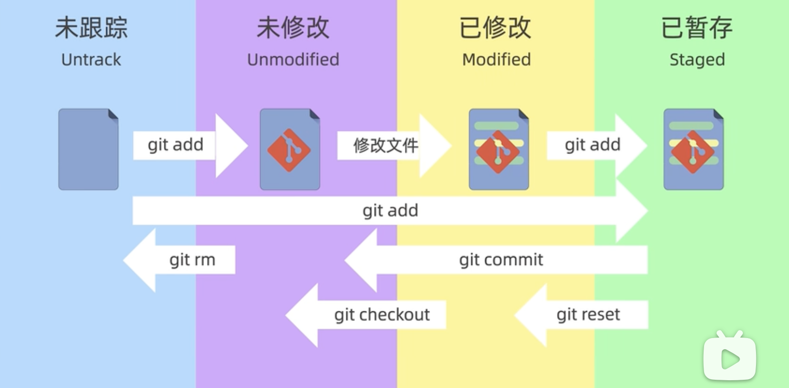
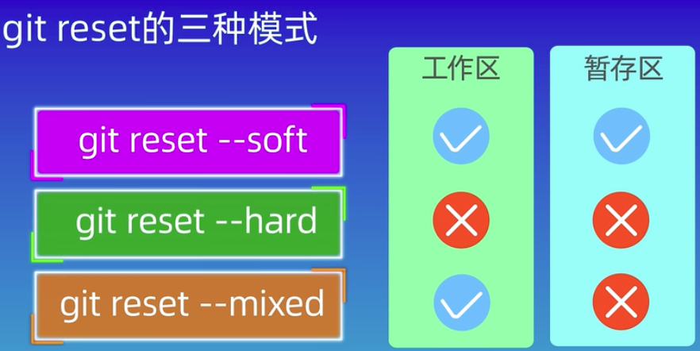
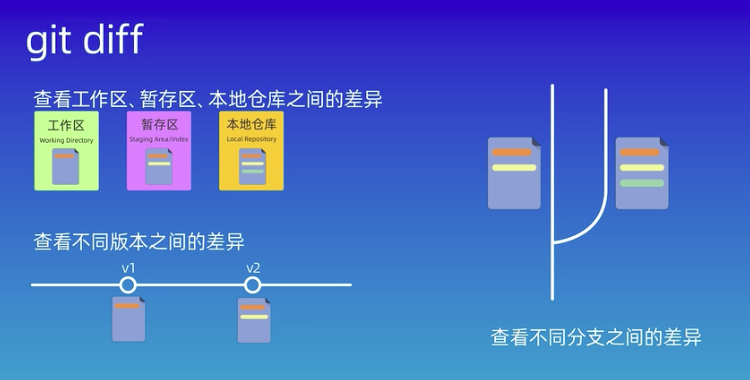

这一小节介绍如何在一个已经创建好的仓库中对文件进行增删。
 






---
## 查看当前文件状态

使用下面命令查看当前正在操作的分支文件状态：
```shell
$ git status
```

---
## 查看暂存区中的文件

使用下面的命令查看在暂存区中的文件有哪些：
```shell
$ git ls-files
```

---
## 查看所有commit

使用下面命令查看当前分支下的所有commit：
```shell
$ git log
```

如果只想查看最近三次的commit：
```shell
$ git log -3
```

----
## 添加/移除全部文件

使用下面命令对当前目录下全部的文件进行添加：
```shell
$ git add .
```

如果执行后想要撤销这次操作则可以使用下面命令，这个命令会将刚才所有添加进来的文件从暂存区中移走：
```shell
$ git reset
```

----
## 删除指定文件

使用下面的命令可以同时删除 **工作空间** & **暂存区** 中的指定文件，但不会删除版本库中的文件：
```shell
$ git rm <filename>
```

如果确定要将这个文件在当前的commit中删除，一定要记得执行一次提交，否则被删除的文件仍然存在。

如果只想要删除 **版本库** 中的文件，但是想要保留工作空间和暂存区的文件，则使用下面的命令： 

```shell
$ git rm --cached <filename> 
```


---
## 添加/移除单个文件

使用下面命令对将指定文件添加到暂存区：
```shell
$ git add <filename>
```

如果想要将所有 `txt` 结尾的文件添加到暂存区，则使用下面命令：
```shell
$ git add *.txt
```
 
如果只想要移走某一个文件则使用下面命令：
```shell
$ git reset <filename>
```

---

## 提交/撤销文件

使用下面命令对刚才添加的文件执行一次提交，这个命令只会提交暂存区中的文件，不会提交暂存区外的其他文件：
```shell
$ git commit -m "this is a commit"
```

如果想要快速提交文件并省略 `add` 操作，可以按照下面的写：
```shell
$ git commit -am "this is a commit"
```

如果想要撤销本次提交使用下面命令，这只是撤销最近一次 `commit` 动作，但不会撤销在这之前的 `add` 动作，即文件仍然是add状态：
```shell
$ git reset --soft HEAD^
```

如果想要撤销本次提交，并且 **丢弃本次更改** 则使用下面命令，这样会导致本次的文件修改全部丢失，如果有新建的文件则会导致整个文件丢失，并且重新回到 **最近一次有效提交上**
```shell
$ git reset --hard HEAD^
```

但是不建议用 `HEAD^` 方式，因为这样需要明确自己当前的位置，容易切错，最佳方式是找到对应提交的hash值，然后使用hash值进行切换：
```shell
$ git log --onelien

7b82bea add a line into orig-master branch
55db100 Merge pull request #1 from 130926C/dev
d19dbe0 (origin/dev) Create dev_func.cpp file
ec195aa Create common_func.cpp file
7de7696 finish initizlize
```

切换到对应的commit：
```shell
$ git reset --soft 7b82bea
```

---
## 查看提交记录

使用下面的命令查看当前分支下所有的提交记录：
```shell
$ git log 
```

也可以通过附加参数的形式查看最近3次提交记录：
```shell
$ git log -3
```

使用 `--oneline`查看简洁的提交记录：
```shell
$ git log --oneline 

e47e6bb (HEAD -> master, origin/master, origin/HEAD) add ignore
7b82bea add a line into orig-master branch
55db100 Merge pull request #1 from 130926C/dev
d19dbe0 (origin/dev) Create dev_func.cpp file
ec195aa Create common_func.cpp file
7de7696 finish initizlize
```

---
## 前往指定提交

使用下面命令可以前往指定提交，语法和前往指定分支一样。：
```shell
$ git checkout <commit>
```

---
## 删除指定提交

在git中其实是没有删除某次提交的功能，底层操作是前往某次提交，然后舍弃当前提交的内容。

使用下面的命令前往另一个提交上，但保留当前修改内容，即在即将前往的commit中会显示文件被修改只不过没有被提交：
```shell
$ git reset --soft <commit>
```

如果确认当前修改内容的确不需要了，则可以使用下面的命令直接舍弃并前往指定commit：
```shell
$ git reset --hard <commit>
```

---
## 操作回溯

git中的所有命令都是可以回溯的，即便出现了误操作包括使用了 `--hard` 命令也是可以恢复的：
```shell
$ git reflog

7b82bea (HEAD -> master) HEAD@{0}: reset: moving to 7b82bea
e47e6bb (origin/master, origin/HEAD) HEAD@{1}: checkout: moving from dev_debug to master
e25ff6b (origin/dev_debug, dev_debug) HEAD@{2}: checkout: moving from master to dev_debug
e47e6bb (origin/master, origin/HEAD) HEAD@{3}: checkout: moving from master to master
e47e6bb (origin/master, origin/HEAD) HEAD@{4}: clone: from github.com:130926C/GitExercise.git
```

然后再回退到旧的版本即可：
```shell
$ git reset --hard e25ff6b
```

---
## 查看工作区和暂存区之间差异

使用 `diff` 命令查看文件差异：
```shell
$ git diff
diff --git a/src/dev_func.cpp b/src/dev_func.cpp
index 21049a8..ef19061 100644
--- a/src/dev_func.cpp
+++ b/src/dev_func.cpp
@@ -8,3 +8,6 @@ int DebBranchAddFunction(){
     printf("This is dev branch add function.");
 }
 
+int GitDiffFunction(){
+    printf("This is git diff command.");
+}
\ No newline at end of file
diff --git a/src/main.cpp b/src/main.cpp
index ddee628..8c46b4a 100644
--- a/src/main.cpp
+++ b/src/main.cpp
@@ -3,5 +3,7 @@
 int main(int argc, char const *argv[])
 {
     printf("This is main function with initialize state");
+
+    printf("This is under master branch with git-diff command.");
     return 0;
 }

```

查看差异时需要分块查看，以 `diff --git` 命令为界告诉你哪些文件存在修改：
```shell
diff --git a/src/dev_func.cpp b/src/dev_func.cpp
index 21049a8..ef19061 100644
--- a/src/dev_func.cpp
+++ b/src/dev_func.cpp
@@ -8,3 +8,6 @@ int DebBranchAddFunction(){
     printf("This is dev branch add function.");
 }
 
+int GitDiffFunction(){
+    printf("This is git diff command.");
+}
\ No newline at end of file
```

* `diff --git a/src/dev_func.cpp b/src/dev_func.cpp`：
	* 正在比较同一个文件的两个版本，即源文件（左侧`a/src/dev_func.cpp`）和目标文件（右侧`b/src/dev_func.cpp`）。
* `index 21049a8..ef19061 100644` ：
	* 哈希值（`21049a8`和`ef19061`）表示文件的旧版本和新版本的Git对象哈希；
	* `100644`是文件的权限模式，表示这是一个普通文件，所有者有读写权限，组和其他用户有只读权限；
* `--- a/src/dev_func.cpp` & `+++ b/src/dev_func.cpp`：
	* 这两行显示对比的文件名。前者表示改动前的文件（带`a/`前缀），后者表示改动后的文件（带`b/`前缀）。
* `@@ -8,3 +8,6 @@：
	* 这是一个hunk头，用于说明接下来的代码修改发生在文件的哪个部分；
	* `-8,3`表示原文件中从第8行开始的3行代码；
	* `+8,6`表示修改后文件中从第8行开始的6行代码；
	* `int DebBranchAddFunction(){`：被修改区域的上下文，用于快速定位至被修改文件的前面；
	* 通过这个就可以知道从 **第8行开始 往下数3行 + 往下数6行** 是被修改区域；
* `+`：添加的代码内容；
* **`\ No newline at end of file`**：
	* 这个警告说明在文件的末尾没有新行符号。Unix风格的文本文件标准要求文件以一个空行结束，而这个文件不遵守这一标准，这可能在某些工具或系统中导致问题；

---
## 查看工作区和版本库之间的差异

如果当前的代码没有执行 `commit` 命令，即没有提交到版本库中，那么就可以使用 `diff` 命令查看工作区与当前版本库之间的差异：
```shell
$ git diff HEAD

diff --git a/src/dev_func.cpp b/src/dev_func.cpp
index 21049a8..5cf1117 100644
--- a/src/dev_func.cpp
+++ b/src/dev_func.cpp
@@ -8,3 +8,6 @@ int DebBranchAddFunction(){
     printf("This is dev branch add function.");
 }
 
+int GitDiffFunction(){
+    printf("This is git diff command.");
+}
diff --git a/src/main.cpp b/src/main.cpp
index ddee628..8c46b4a 100644
--- a/src/main.cpp
+++ b/src/main.cpp
@@ -3,5 +3,7 @@
 int main(int argc, char const *argv[])
 {
     printf("This is main function with initialize state");
+
+    printf("This is under master branch with git-diff command.");
     return 0;
 }
```

使用上一小节中的解释即可。

---
## 查看暂存区与版本库之间的差异

使用下面的命令查看暂存区与版本库之间的差异：
```shell
$ git diff --cached
```

使用上一小节中的解释即可。

---
## 查看两个指定版本之间的差异

使用下面命令查看两个指定版本之间的差异：
```shell
$ git diff e25ff6b 4d7f2e8
```

如果只想要比较 **某个版本** 和当前版本之间的差异则可以使用 `HEAD` 字段：
```shell
$ git diff 7db9664 HEAD
```

如果只想要比较 **上一个版本** 和当版本之间的差异，则提供了简便方式：
```shell
$ git diff HEAD^ HEAD
```

也可以 **回溯多个版本** ：
```shell
$ git diff HEAD~2 HEAD
```

也可以指定版本中 **指定文件**：
```shell
$ git diff HEAD~ HEAD src/main.cpp
```

----

