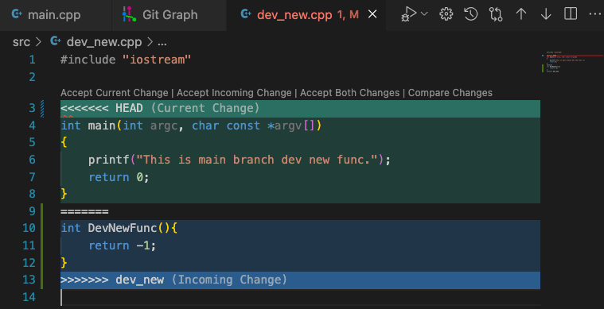

这一篇将介绍分支管理相关的内容

---
## 创建新的分支

使用下面的命令创建了一个名为 `dev` 的分支：
```shell
$ git checkout -b dev
```

---
## 查看当前所有分支

```shell
$ git branch --all
```

---
## 删除指定分支

使用下面命令将 `dev` 分支删除：
```shell
$ git branch -d dev
```

如果当前分支有没有提交的内容会删除失败，这时候就可以执行强制分支删除：
```shell
$ git branch -D dev
```

---
## 合并分支

使用下面命令将分支 `dev_new`中的内容合并到分支 `main`中：
```shell
$ git checkout main
$ git merge dev_new
```
【注意】必须先切换到 `main` 分支后再去合并分支 `dev_new`。

### 冲突处理（GUI界面）

在 `merge` 命令输入后会在 vscode 中提示存在冲突的地方，如下图所示：

上图中有几个选项：
* `Accept Current Change`：仅保留当前分支的内容；
* `Accept Incoming Change`：仅保留输入分支的内容；
* `Accept Both Changes`：当前分支和输入分支的内容都保留；
* `Compare Changes`：对比两个文件之间存在的差异（这个对比是逐行对比）；

如果有需要则可以点击右下角的 `Resolve in conflict editor` 按钮在编辑器中处理冲突。根据实际情况选择需要保留哪些内容，在处理完成后重新执行合并操作：
```shell
$ git merge dev_new
```
或者使用 `add` 和 `commit` 命令自动完成合并：
```shell
$ git add .
$ git commit -m "complate a merge from dev_new to master"
```

此时的 `dev_new` 分支仍然是保留的，但 `main` 分支已经将 `dev_new` 分支中最新的部分吸收进来了，根据需要选择是否删除这个分支。

### 撤销本次合并

在 `merge` 操作后又可能发现合并错了，那么就需要撤销本次合并操作，使用下面命令可以撤销本次合并操作，但是 **保留更改** 不保留提交：
```shell
$ git reset --soft HEAD~1
```

如果确定直接舍弃这次提交与更改，则使用下面的命令，这样就会退回到最初的状态：
```shell
$ git reset --hard HEAD~1
```

---

