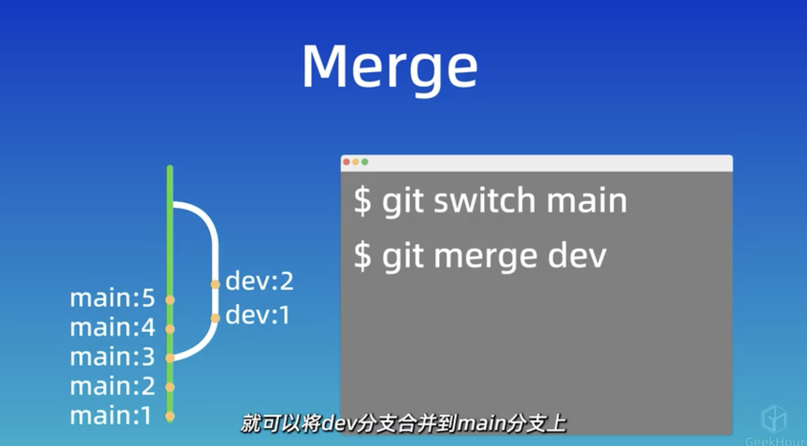
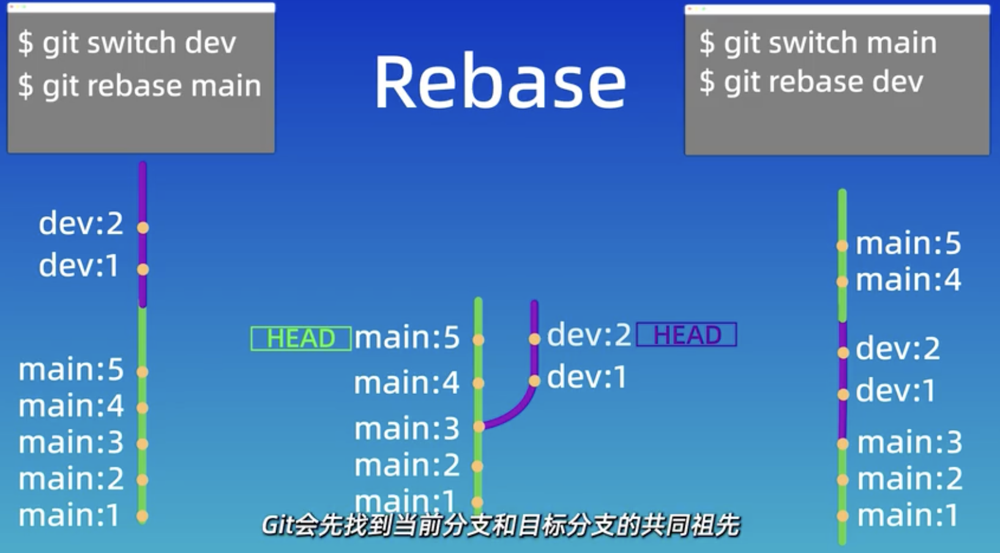

git中有一个变基的概念，这篇文章将介绍相关操作。

---
## 与 merge 命令 的区别

`merge` 命令是将 `dev` 分支合并到 `main` 分支上，然后在 `main` 分支上多一条提交记录，原来的 `dev`分支仍然存在：

但是 `rebase` 操作可以在任意一个分支上（`dev`, `main`）执行操作，下图展示了两种 `rebase` 操作：

*  在 `dev` 分支上执行 `rebase`：让 `dev` 分支上的两次commit变基到 `main` 分支上；
*  在 `main` 分支上执行`rebase`：让 `main` 分支上的两次commit变基到 `dev` 分支上；

执行步骤：	
1. 找到当前分支上的 **最近** 共同祖先 `main:3`；
2. 将共同祖先以后的所有内容移动到当前分支的 **最新** 提交后面；

