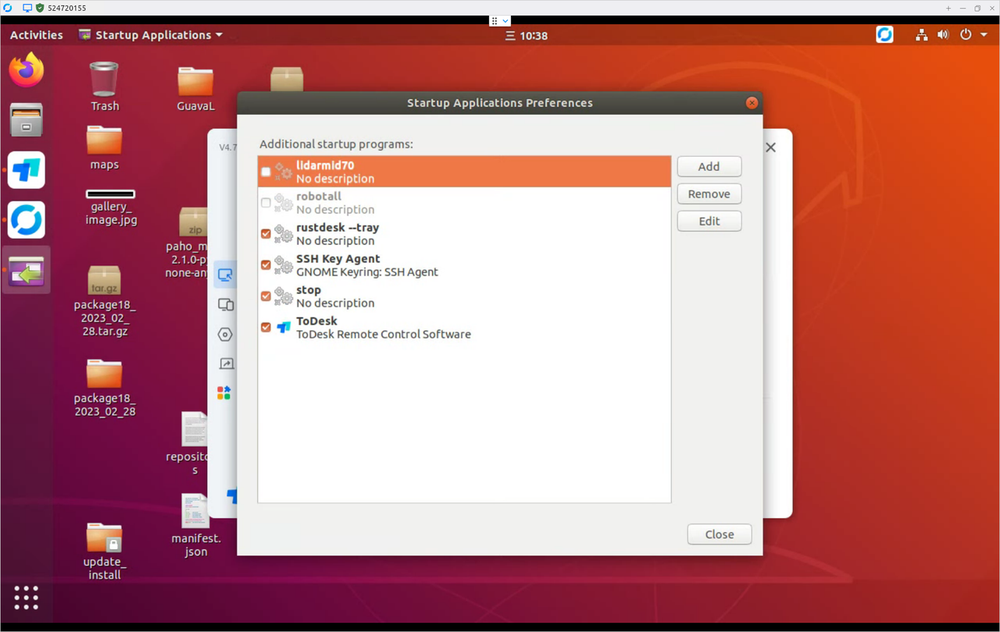

这个文档介绍了如何进行ROS程序的开机自启，在需要网卡外设、不登陆GUI界面的情况下实现自启功能。

---
## Step1. 关闭原先的开机自启配置

进入GUI界面将原先在 `Startup Application Performance` 软件设置的开机自启程序关闭：


----
## Step2. 配置bash文件

这个文件就是机器人启动脚本 `all_bringup.sh`
```bash
#!/bin/bash
export USER=cybertron # 显式指明USER变量

cd /home/${USER}/giraffe_ws/install

source /opt/ros/melodic/setup.sh
source /home/${USER}/3rdparty/moveit_ws/devel/setup.sh
source /home/${USER}/giraffe_ws/install/setup.bash

roslaunch /home/${USER}/giraffe_ws/install/all_bringup.launch
```
其中一定要显式指明 `USER` 变量，因为开机自启的时候不会加载用户。

添加脚本可执行权限：
```shell
$ chmod 777 all_bringup.sh
```

---
## Step3. 添加开机自启服务

在添加开机自启服务时需要确认网卡都被拉起来后才才能执行拉起脚本。
```shell
$ sudo vim /lib/systemd/system/robot_bringup.service
```

```shell
[Unit]
StartLimitBurst=3        # 最多尝试重启三次
Description=Robot startup service

# 等待网卡服务上线
After=network.target
Wants=network.target
After=network-online.target
Wants=network-online.target

[Service]
Environment="HOME=/home/cybertron"
Environment="USER=cybertron"
Type=simple
ExecStart=/home/cybertron/giraffe_ws/install/all_bringup.sh
Restart=on-failure       # 在拉起失败后尝试重启
RestartSec=10            # 单次重启时间间隔

[Install]
WantedBy=multi-user.target
```

---
## Step4. 激活网卡等待服务

```Bash
$ sudo systemctl enable NetworkManager-wait-online.service
$ sudo systemctl enable systemd-networkd-wait-online.service
```

如果上面第一行命令报下面的错则忽略继续执行第二行命令：

```Bash
Failed to enable unit: Unit file NetworkManager-wait-online.service does not exist.
```

---
## Step5. 重载守护进程管理器并注册服务

```Bash
$ sudo systemctl daemon-reload
$ sudo systemctl enable robot_bringup.service
```

---
## 管理节点方式：

使用上面的方式进行开机自启就可以通过下面的方式管理整个机器人节点：

```Bash
$ sudo systemctl stop robot_bringup.service
```

如果在开机后机器人没有正常启动，可以通过以下命令查看两个服务状态，服务正常开启如下：

```Bash
$ sudo systemctl status robot_bringup.service

● robot_bringup.service - Robot startup service
   Loaded: loaded (/lib/systemd/system/robot_bringup.service; enabled; vendor preset: enabled)
   Active: active (running) since Wed 2024-12-18 10:45:07 CST; 609ms ago
 Main PID: 2536 (all_bringup.sh)
    Tasks: 3 (limit: 4915)
   CGroup: /system.slice/robot_bringup.service
           ├─2536 /bin/bash /home/cybertron/giraffe_ws/install/all_bringup.sh
           ├─2593 /usr/bin/python /opt/ros/melodic/bin/roslaunch /home/cybertron/giraffe_ws/install/all_bringup.launch
           └─2619 /usr/bin/python2 /opt/ros/melodic/bin/xacro /home/cybertron/giraffe_ws/install/share/cyber_qgv2_jakazu5_description/urdf/dpgt_robot_ewe.xacro

12月 18 10:45:07 cybertron-Default-string systemd[1]: Started Robot startup service.
12月 18 10:45:08 cybertron-Default-string all_bringup.sh[2536]: WARNING: disk usage in log directory [/home/cybertron/.ros/log] is over 1GB.
12月 18 10:45:08 cybertron-Default-string all_bringup.sh[2536]: It's recommended that you use the 'rosclean' command.
```