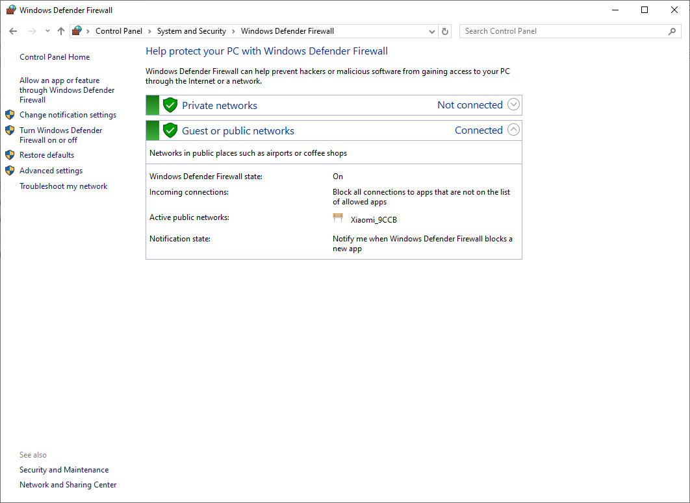

在刚开始配置windows10时会出现在同一个局域网内无法ping通的情况，这篇文章用来介绍如何应对。

参考链接：[windows连接同一wifi无法互ping_两天电脑共用一个无线网 无法ping通-CSDN博客](https://blog.csdn.net/qq_37310913/article/details/119846389?spm=1001.2101.3001.6650.1&utm_medium=distribute.pc_relevant.none-task-blog-2%7Edefault%7EBlogCommendFromBaidu%7ERate-1-119846389-blog-121963395.235%5Ev43%5Epc_blog_bottom_relevance_base8&depth_1-utm_source=distribute.pc_relevant.none-task-blog-2%7Edefault%7EBlogCommendFromBaidu%7ERate-1-119846389-blog-121963395.235%5Ev43%5Epc_blog_bottom_relevance_base8&utm_relevant_index=2)

1. 在搜索框中输入 `Windows Defender Firewall`;
2. 打开后进入 `Advanced Setting` 即 `高级设置`；

3. 在左侧工具栏中选择 `Inbound Rules` 即 `入站规则`；

4. 找到 `File and Printer Sharing (Echo Request - ICMPv4-In)` 即 `文件与打印共享`，将 `Enabled` 勾选上然后点击 `Apply`；

