视频链接：
https://www.bilibili.com/video/BV1Mg4y127Z9?spm_id_from=333.788.videopod.episodes&vd_source=c8dbe5ab3b4bf743fae13d455b4aa039&p=3

---
 ## MoveIt 可视化配置

 使用 `Setup Assistant` 工具进行辅助配置，该工具要求在moveit功能包安装好的前提下运行。
```shell
$ sudo apt-get install ros-melodic-moveit
```

```shell
$ rosrun moveit_setup_assistant moveit_setup_assistant
```

整个MoveIt实现了三大功能：
1. Kinematics 运动学正逆求解器；
2. Path Planning：路径规划；
3. Collision Checking：碰撞检测；

| **特性**   | **运动学求解器**          | **路径规划**             |
| -------- | ------------------- | -------------------- |
| **处理范围** | 单一关节配置或末端位姿         | 完整的轨迹，从起点到终点         |
| **空间范围** | 局部问题（单个末端位姿）        | 全局问题（包含障碍物和运动学约束）    |
| **目标**   | 计算特定目标的关节角度         | 生成无碰撞、可执行的运动路径       |
| **依赖性**  | 独立使用                | 通常调用运动学求解器来检查或计算关节配置 |
| **常见算法** | KDL, IKFast, TracIK | OMPL, CHOMP, STOMP   |
| **输出**   | 单个关节角度或关节组解         | 包含时间参数的完整轨迹（位置、速度等）  |

---
### 1. Start

在打开的 start 界面中点击 `Create New MoveIt Configuration Package` 按钮并选择一个 `xacro` 或者 `urdf` 文件。

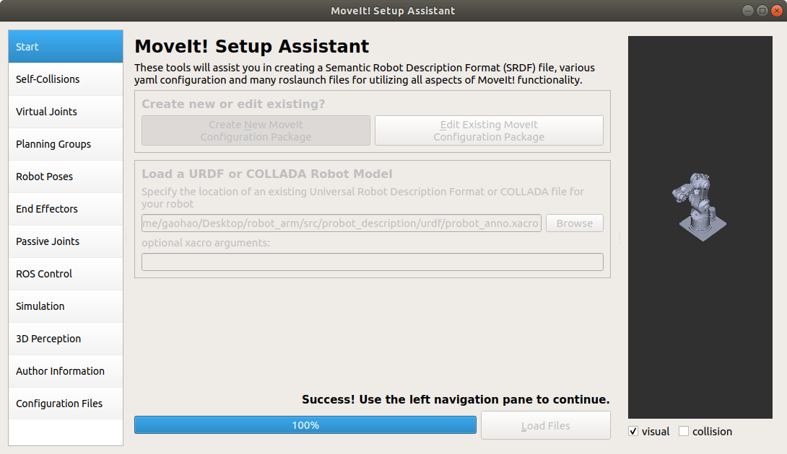

【注】：在使用工具进行导入的时候仍然需要对工作空间进行编译，否则会提示找不到对应的功能包。

---

### 2. Optimize Self-Collision Checking

执行关节自碰撞自动检测，在 `Self-Collections` 界面点击 `Genrarte Collision Martix` 按钮进行关节静态自动检测。

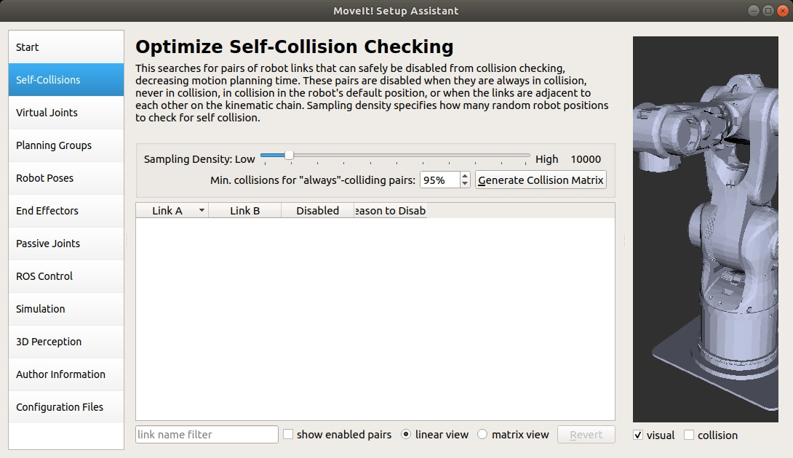

---
### 3. Virtual Joints

定义虚拟关节，如果机械臂底座是一个移动底盘，导致world坐标系会跟随机械臂base_link坐标系发生变化，则需要定义一个虚拟关节，否则不需要定义。

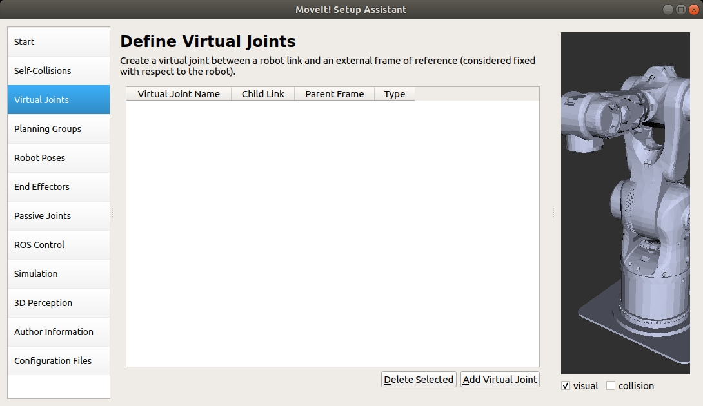

---
### 4. 【重要】Planning Groups

设置机械臂正逆运动学规划组，这会直接影响到机械臂运动规划的效率。
该界面的意义在于执行路径规划时以 `组` 为单位进行规划，即在规划时联合考虑组内所有关节的位置。

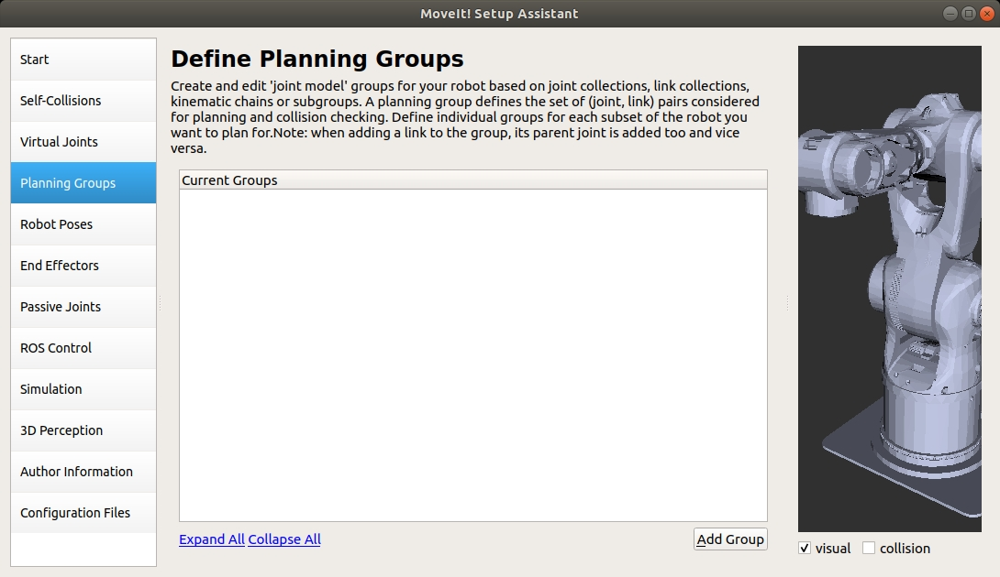

点击 `Add Group`  在弹出的窗口中进行配置：

* Group Name: 规划组名，在规划的程序中调用的组名；
* Kinematic Solver：正逆解求解器；
* Group Default Planner：默认运动规划器；

【注】：这里软件打开后与教学视频中展示的存在差异，教学视频中有 `Kin. Solver Attempts` 二次规划次数，而本机软件打开后为 `Kin. parameters file` 参数配置文件，这里可以暂时跳过继续后续步骤。

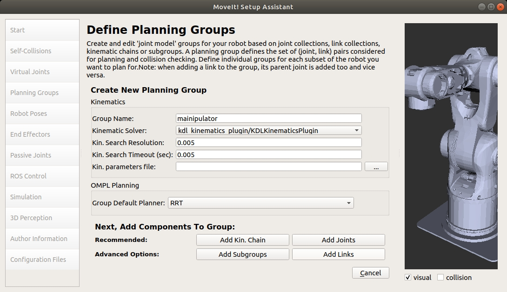


* Add Kin. Chain：添加运动学求解链，主要用来指明该规划组中具体包含哪些关节； 
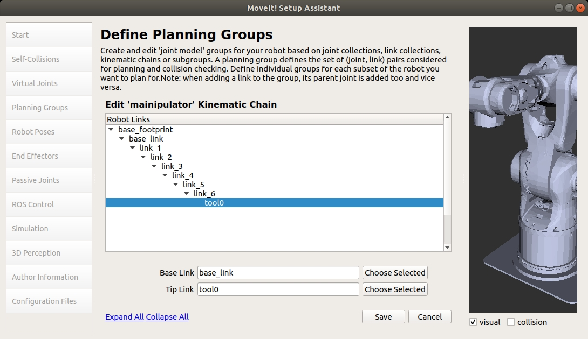

在弹出的界面中选择 `Base Link` 即该规划组的底座 Link、`Tip Link` 即该规划组的顶端 Link；这样就能让规划器在规划时将从底座关节一直包含致顶端关节上；

如果机械臂顶端有一个夹爪的话还需要额外添加一个规划组。

---
### 5. Robot Poses

在该界面可以添加一些特殊姿态，如 `home`、`forward` 等

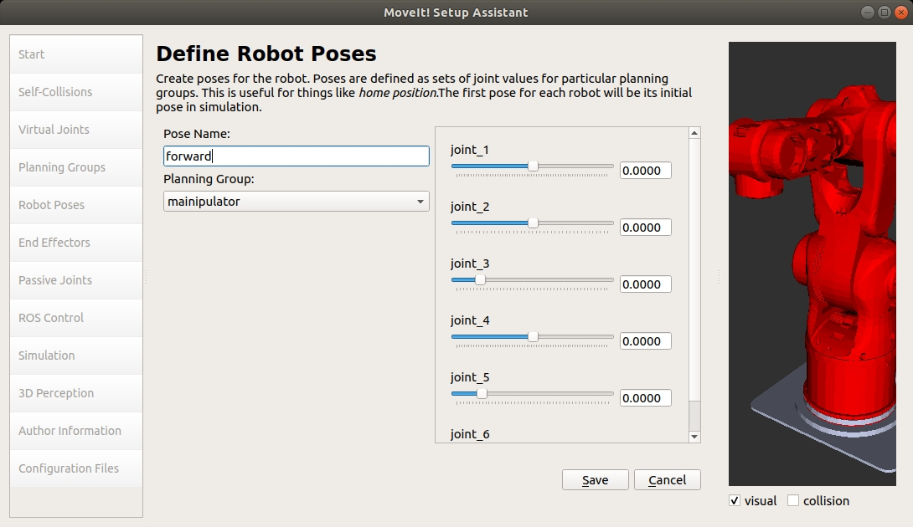

---
### 6. End Effectors

在该界面上可以添加终端位置处的夹爪，在教学视频的示例中没有夹爪就不进行配置。

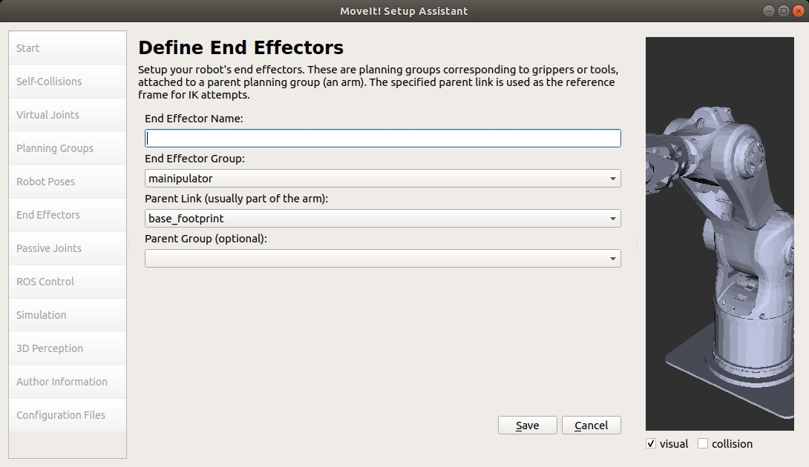

---
### 7. Passive Joints

添加消极(被动)关节，消极关节概念如下（来自GPT）：

1. 定义：被动关节是那些在规划过程中**不直接由 MoveIt 控制**的关节。换句话说，这些关节的运动并不是由规划器生成的指令驱动，而是**依赖外部因素或约束关系**来确定其值。
2. 特点：
	*  这些关节通常在运动学链中被认为是非驱动关节；
	*  在规划过程中，它们会被视为固定的，或者它们的运动被假定为由其他方式（如被动驱动、弹簧力、引力等）决定。

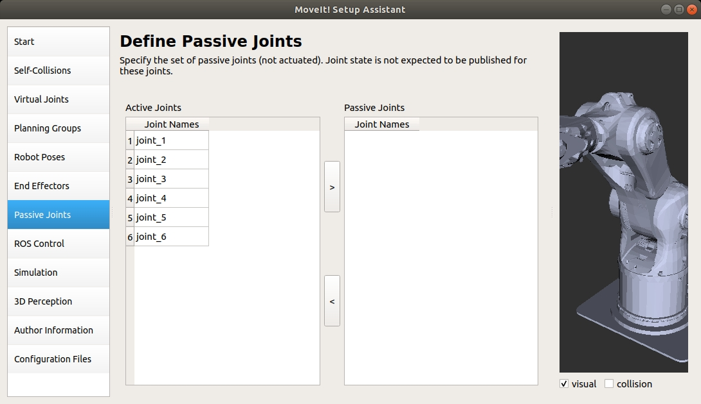

以下是一些典型的应用场景：
1. **机器人末端的工具（End Effector）**： 如果末端执行器（如机械手爪）中有一些关节可以自由旋转（如通过引力或弹簧驱动），可以将其标记为被动关节。
2. **挂载在移动底盘上的机械臂**： 移动底盘的轮子或基座的关节通常是被动关节，因为这些关节的状态通常由外部控制系统决定，而不是由 MoveIt 规划的。
3. **柔性关节**： 某些机械臂可能有弹性或柔性关节，实际状态取决于机械结构或环境作用力。
4. **复杂系统中的从动关节**： 在多机械臂系统中，一个机械臂的某些关节可能被动地跟随另一个机械臂的运动。

【注意】规划组中包含了**所有关节**，需要谨慎对待 Passive Joints 的设置：

1. **规划器无法控制 Passive Joints**： 如果某些关节被标记为被动关节，MoveIt 不会对其进行任何规划，而是假设它们的值是已知的或可以通过其他方式计算得出。
2. **影响运动规划的自由度**：
    - 如果你将一个关节设置为被动关节，它将被从规划器的自由度（DoF）中移除。这样可能会减少运动规划的计算复杂性，但也可能限制规划器生成的路径。
    - 如果所有关节都在规划组中且没有特殊需求，通常不需要将任何关节设置为被动关节。
3. **确保被动关节的状态一致**： 对于被动关节，你需要确保在实际应用中有机制（如外部控制器、仿真环境）来提供其状态信息，否则可能导致 MoveIt 生成的运动不符合实际。

---

### 8. ROS Control

于配置和集成 MoveIt 与 ROS 控制框架（`ros_control`）的交互，本质就是加载控制器，使用插件实现对机器人的关节或组件的控制。

**ROS Control** 的核心组件包括：
- **Controller Manager**：负责加载和管理控制器。
- **Controllers**：特定类型的控制器插件，例如位置控制、速度控制、力/扭矩控制等。
- **Hardware Interface**：抽象层，用于连接机器人硬件。

【注】：这个工具貌似存在bug，建议手动进行配置；

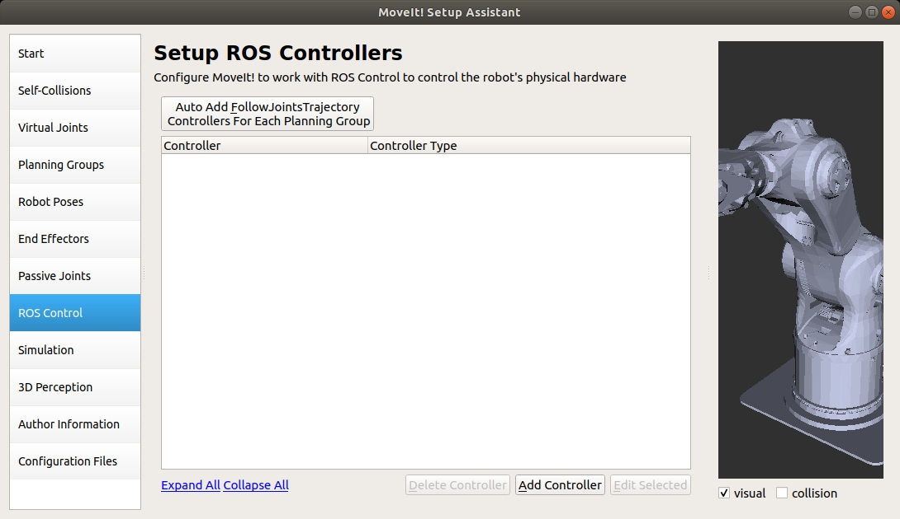


---
### 9. Simulation

针对模型产生一个给 Gazebo 仿真使用的模型文件。

【注】：该工具也存在一些问题，后续进行手动添加； 

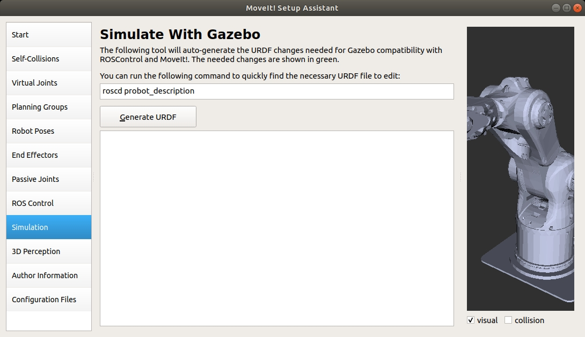


---
### 10. 3D Perception

添加3D感知，使用一个话题可以将环境信息加载进来。

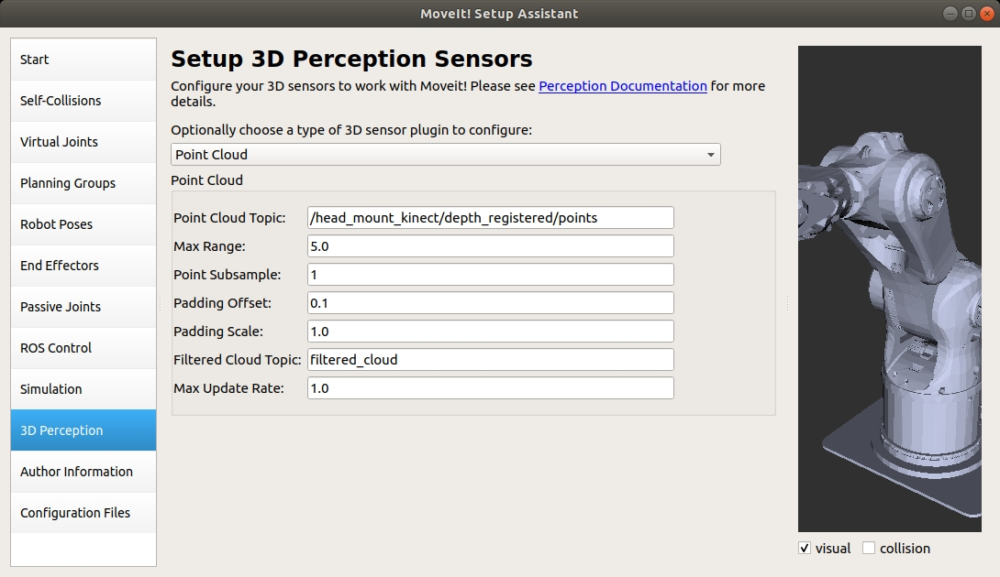


---
### 11. Author Information

作者信息填写，填写后可以将功能包分享出去，对方即可通过邮件与你进行沟通。

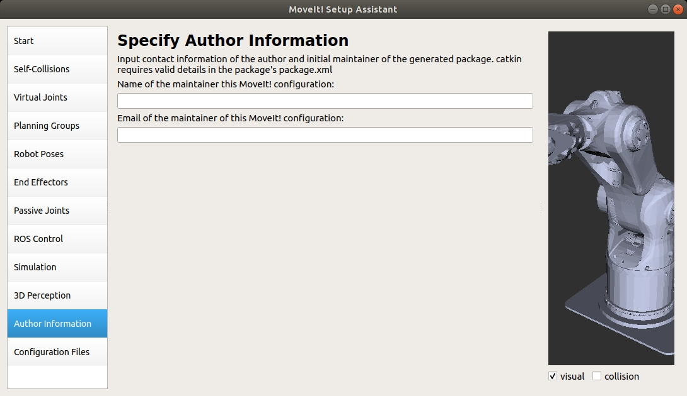


---
### 12. Configuration Files

根据上面的配置信息自动生成配置文件，点击 `Browse` 选择一个配置包存储的位置，这里推荐在每次存储配置包时新建一个文件夹，并以约定俗称的后缀 `moveit_config` 结尾以方便阅读。

【注】：在点击 `Generate Package` 按钮后如果弹出提示有些信息没有配置，只要不是报错就可以直接跳过继续；

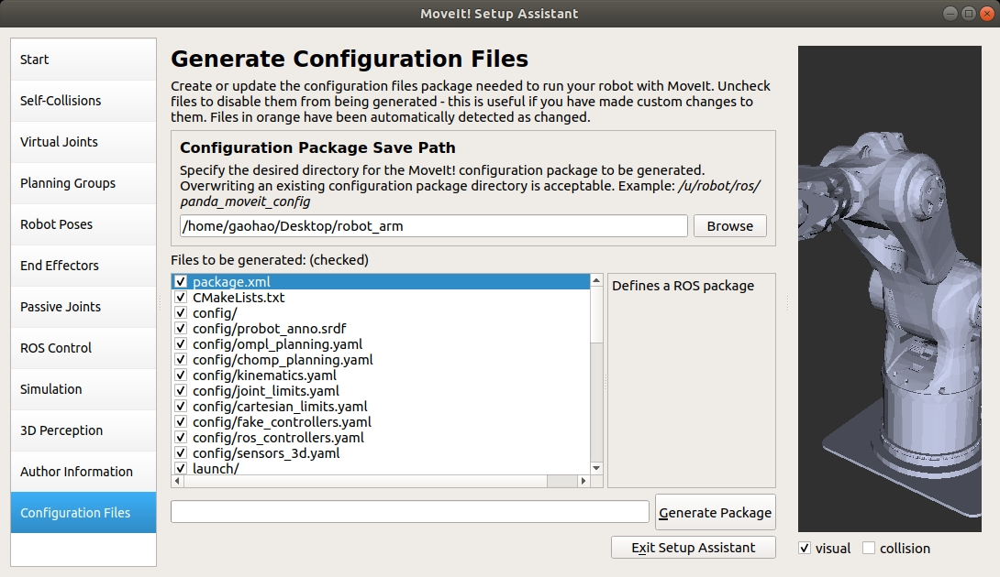

完成生成后点击 `Exit Setup Assistant` 按钮就可以退出生成配置文件界面。

在结束生成后主要关注 `config` 和 `launch` 这两个文件夹，里面的内容还是上面界面中的配置的部分，只不过保存成了一个文本文件：
```shell
(base) gaohao@ThinkPadX1G9:~/Desktop/robot_arm/src/probot_anno_moveit_config$ tree
.
├── CMakeLists.txt
├── config
│   ├── cartesian_limits.yaml
│   ├── chomp_planning.yaml
│   ├── fake_controllers.yaml
│   ├── joint_limits.yaml
│   ├── kinematics.yaml
│   ├── ompl_planning.yaml
│   ├── probot_anno.srdf
│   ├── ros_controllers.yaml
│   └── sensors_3d.yaml
├── launch
│   ├── chomp_planning_pipeline.launch.xml
│   ├── default_warehouse_db.launch
│   ├── demo_gazebo.launch
│   ├── demo.launch
│   ├── fake_moveit_controller_manager.launch.xml
│   ├── gazebo.launch
│   ├── joystick_control.launch
│   ├── move_group.launch
│   ├── moveit.rviz
│   ├── moveit_rviz.launch
│   ├── ompl_planning_pipeline.launch.xml
│   ├── pilz_industrial_motion_planner_planning_pipeline.launch.xml
│   ├── planning_context.launch
│   ├── planning_pipeline.launch.xml
│   ├── probot_anno_moveit_controller_manager.launch.xml
│   ├── probot_anno_moveit_sensor_manager.launch.xml
│   ├── ros_controllers.launch
│   ├── run_benchmark_ompl.launch
│   ├── sensor_manager.launch.xml
│   ├── setup_assistant.launch
│   ├── trajectory_execution.launch.xml
│   ├── warehouse.launch
│   └── warehouse_settings.launch.xml
└── package.xml

2 directories, 34 files
```

---

在工作空间中进行编译然后运行 demo 演示：
```shell
$ catkin build
$ roslaunch probot_anno_moveit_config demo.launch
```

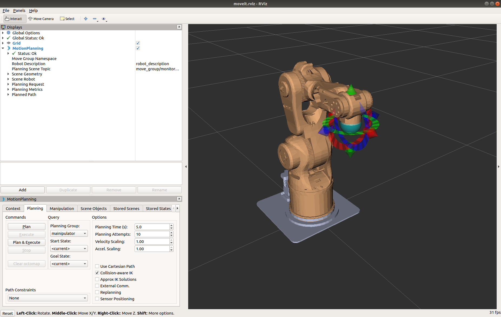

1. 拖动机械臂末端的球到达想要前往的位置；
2. 在左侧插件栏中打开 `Planning` 界面中的 `Plan` 按钮先进行规划；
3. 查看规划动画后点击 `Exeucte` 即可让机械臂执行规划出来的路径；

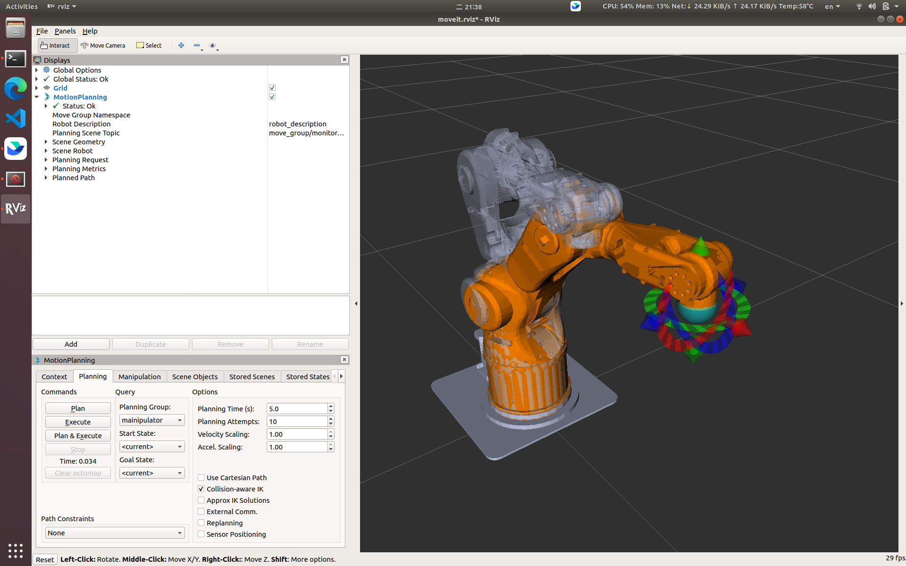
