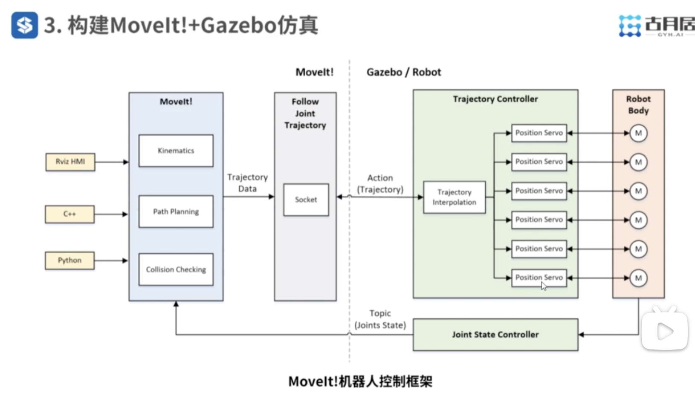
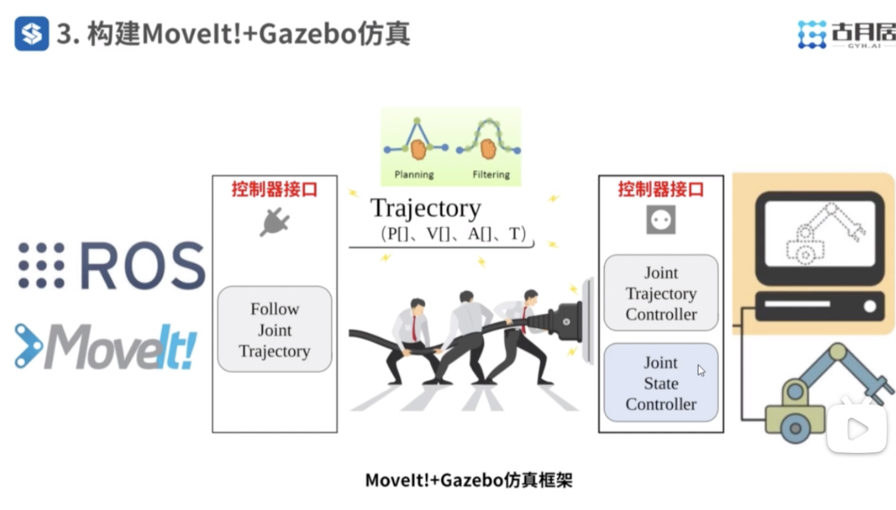

视频链接：
https://www.bilibili.com/video/BV1Mg4y127Z9/?spm_id_from=333.788.videopod.episodes&vd_source=c8dbe5ab3b4bf743fae13d455b4aa039&p=4

---

机械臂控制器（Controller）主要包含以下四个部分：
* joint_state_controller：用于监控机器人的状态，实际上并不参与控制；
* joint_effort_controller：
* joint_position_controller：机械臂各个关节位置控制器；
* joint_velocity_controller：

---
## 添加质量与惯性参数

在仿真之前还需要对机器人模型进行完善才能放入gazebo；

在gazebo的仿真中必须包含以下参数：
* 惯性参数 inertial；
* 可视化参数 visual；
* 碰撞参数 collision；

【注】：尽管在 SolidWorks 等软件中使用质量参数可以正确配置，但导入的gazebo中后质量参数会极大影响到仿真结果，因此常规的做法是 **小质量** + **大惯性参数**；
```xml
<link name="link_1">
	<!-- 惯性参数 -->
	<inertial>
		<origin xyz="-0.010 0.233 0.059" rpy="0 0 0"/>
		<mass value="0.00001"/>
		<inertial ixx="10" ixy="0.0" ixz="0.0" iyy="10" iyz="0.0" izz="10"/>
	</inertial>
	<!-- 可视化参数 -->
	<visual>
		<origin xyz="0 0 0" rpy="0 0 0" />
		<geometry>
			<messh filename="package://probot_description/meshed/link_1.STL" />
		</geometry>
		<material name="">
			<color rgba="0.79 0.81 0.933 1"/>
		</material>
	</visual>
	<!-- 碰撞参数 -->
	<collision>
		<origin xyz="0 0 0" rpy="0 0 0" />
		<geometry>
			<mesh filename="package://probot_description/meshed/link_1.STL"/>
		</geometry>
	</collision>
</link>
```

---
## 为joint添加传动装置

使用xacro个每个关节添加传动装置。

`probot_description/urdf/probot_anno.xacro`:

```xml
  <!-- Transmissions for ROS Control -->
  <xacro:macro name="transmission_block" params="joint_name">
    <transmission name="tran1">
      <type>transmission_interface/SimpleTransmission</type>
      <joint name="${joint_name}">
        <hardwareInterface>hardware_interface/PositionJointInterface</hardwareInterface>
      </joint>
      <actuator name="motor1">
        <hardwareInterface>hardware_interface/PositionJointInterface</hardwareInterface>
        <mechanicalReduction>1</mechanicalReduction>
      </actuator>
    </transmission>
  </xacro:macro>
  
  <xacro:transmission_block joint_name="joint_1"/>
  <xacro:transmission_block joint_name="joint_2"/>
  <xacro:transmission_block joint_name="joint_3"/>
  <xacro:transmission_block joint_name="joint_4"/>
  <xacro:transmission_block joint_name="joint_5"/>
  <xacro:transmission_block joint_name="joint_6"/>
```

* `PositionJointInterface`：位置控制指令；

---
## 为gazebo添加电机

就是在上面软件中配置的 ROS Controller。

`probot_description/urdf/probot_anno.xacro`:

```xml
  <!-- ros_control plugin -->
  <gazebo>
    <plugin name="gazebo_ros_control" filename="libgazebo_ros_control.so">
      <robotNamespace>/probot_anno</robotNamespace>
      <robotSimType>gazebo_ros_control/DefaultRobotHWSim</robotSimType>
      <legacyModeNS>true</legacyModeNS>
    </plugin>
  </gazebo>
```

* `DefaultRobotHWSim`：机器人仿真类型，使用默认的仿真接口；

----
## 在gazebo中加载仿真模型

`probot_gazebo/launch/probot_anno/probot_anno_gazebo_world.launch`

```xml
<launch>

  <!-- these are the arguments you can pass this launch file, for example paused:=true -->
  <arg name="paused" default="false"/>
  <arg name="use_sim_time" default="true"/>
  <arg name="gui" default="true"/>
  <arg name="headless" default="false"/>
  <arg name="debug" default="false"/>

  <!-- We resume the logic in empty_world.launch -->
  <include file="$(find gazebo_ros)/launch/empty_world.launch">
    <arg name="debug" value="$(arg debug)" />
    <arg name="gui" value="$(arg gui)" />
    <arg name="paused" value="$(arg paused)"/>
    <arg name="use_sim_time" value="$(arg use_sim_time)"/>
    <arg name="headless" value="$(arg headless)"/>
  </include>

  <!-- Load the URDF into the ROS Parameter Server -->
  <param name="robot_description" command="$(find xacro)/xacro --inorder '$(find probot_description)/urdf/probot_anno.xacro'" /> 

  <!-- Run a python script to the send a service call to gazebo_ros to spawn a URDF robot -->
  <node name="urdf_spawner" pkg="gazebo_ros" type="spawn_model" respawn="false" output="screen"
	args="-urdf -model probot_anno -param robot_description"/> 

</launch>
```


----
## 运行仿真环境

```shell
$ catkin build
$ roslaunch probot_gazebo probot_anno_gazebo_world.launch
```

如果想要在gazebo中添加官方提供的默认模型，还需要到github链接中下载，总大小1.28GB：
```shell
$ git clone git@github.com:osrf/gazebo_models.git
```

这里已经将模型上传到自己的网盘中，可以通过百度云链接进行下载：
```txt
https://pan.baidu.com/s/1HNTVCx6lGGrP43ZyTHj_lg?pwd=rjnv 提取码: rjnv 
```

然后将模型放在默认的目录下，没有这个文件夹就自行创建：
```shell
$ /home/${USER}/.gazebo/models/
```

---
## MoveIt 框架




---
## MoveIt + Gazebo 仿真框架



---
## 添加轨迹关节控制器

关节控制器本质还是一个插件，使用yaml文件传入配置参数：
`probot_gazebo/launch/probot_anno/probot_anno_trajectory_controller.launch`

ROS提供了三个默认的关节轨迹控制器插补算法，默认使用的是五次样条：

| 算法   | 位置  | 速度  | 加速度 |
| ---- | --- | --- | --- |
| 线性样条 | 连续  |     |     |
| 三次样条 | 连续  | 连续  |     |
| 五次样条 | 连续  | 连续  | 连续  |

### 位置连续
* 定义：关节角度在整个运动过程中没有不连续的跳变，即曲线是平滑的，没有断点。
* 意义：确保机械臂从起点到终点的轨迹是连贯的，不会出现瞬间的大幅度跳动。
* Example：如果关节角度从 30∘30∘ 瞬间跳到 60∘60∘，则位置是不连续的。
算法输出步长应小于机械臂关节的最大允许角速度乘以时间步长：
$$
Δ\theta≤\omega_{max}⋅ΔtΔ\theta≤\omega_{max}​⋅Δt
$$

### 速度连续
* 定义：关节角度的变化率（速度）在整个轨迹上是连续的，没有突变。
* 意义：确保机械臂的运动平稳，避免突然的速度变化导致机械臂抖动或震动。
* Example：如果速度从 10∘/s10∘/s 瞬间跳到 50∘/s50∘/s，则速度是不连续的，这可能引发关节震动。
算法输出步长应小于关节的最大允许加速度乘以时间步长：
$$
Δ\omega≤\alpha_{max}​⋅Δt
$$

### 加速度连续
* 定义：关节角度的加速度（速度的变化率）在整个轨迹上是连续的，没有突变。
* 意义：确保机械臂的运动更加平滑，避免机械臂因加速度的突变而受到冲击力的影响。
* Example：如果加速度从 5∘/s25∘/s2 瞬间跳到 50∘/s250∘/s2，则加速度是不连续的，这可能导致机械臂出现剧烈的机械冲击。
算法输出步长应小于机械臂动力学模型允许的最大跃变：
$$
Δα≤J_{max}​
$$

上述的三个变量（最大速度$\omega_{max}$、最大加速度 $\alpha_{max}$、最大加加速度$Δα$）都需要查看机械臂硬件制造商处获得；


```xml
<launch>

    <rosparam file="$(find probot_gazebo)/config/probot_anno_trajectory_control.yaml" command="load"/>

    <node name="arm_controller_spawner" pkg="controller_manager" type="spawner" respawn="false"
          output="screen" ns="/probot_anno" args="arm_joint_controller"/>

</launch>
```

`probot_gazebo/config/probot_anno_trajectory_control.yaml`：
```yaml
probot_anno:
  arm_joint_controller:
    type: "position_controllers/JointTrajectoryController"
    joints:   # 控制器需要控制的关节名，下面的关节名一定要和urdf文件中的名字对应
      - joint_1
      - joint_2
      - joint_3
      - joint_4
      - joint_5
      - joint_6

    gains:    # 控制器PID仿真参数
      joint_1:   {p: 1000.0, i: 0.0, d: 0.1, i_clamp: 0.0}
      joint_2:   {p: 1000.0, i: 0.0, d: 0.1, i_clamp: 0.0}
      joint_3:   {p: 1000.0, i: 0.0, d: 0.1, i_clamp: 0.0}
      joint_4:   {p: 1000.0, i: 0.0, d: 0.1, i_clamp: 0.0}
      joint_5:   {p: 1000.0, i: 0.0, d: 0.1, i_clamp: 0.0}
      joint_6:   {p: 1000.0, i: 0.0, d: 0.1, i_clamp: 0.0}
```

`probot_gazebo/config/probot_anno_gazebo_joint_states.yaml`：
```yaml
probot_anno:
  # Publish all joint states -----------------------------------
  joint_state_controller:
    type: joint_state_controller/JointStateController
    publish_rate: 50  # 状态发布频率
```

启动关节控制器：
```xml
<launch>
    <!-- 将关节控制器的配置参数加载到参数服务器中 -->
    <rosparam file="$(find probot_gazebo)/config/probot_anno_gazebo_joint_states.yaml" command="load"/>

    <node name="joint_controller_spawner" pkg="controller_manager" type="spawner" respawn="false"
          output="screen" ns="/probot_anno" args="joint_state_controller" />

    <!-- 运行robot_state_publisher节点，发布tf  -->
    <node name="robot_state_publisher" pkg="robot_state_publisher" type="robot_state_publisher"
        respawn="false" output="screen">
        <remap from="/joint_states" to="/probot_anno/joint_states" />
    </node>

</launch>
```

```shell
$ roslaunch probot_gazebo probot_anno_gazebo_states.launch 
```

---
## 配置 MoveIt 控制器

`probot_anno_moveit_config/config/controllers_gazebo.yaml`：
```yaml
controller_manager_ns: controller_manager
controller_list:
  - name: probot_anno/arm_joint_controller
    action_ns: follow_joint_trajectory
    type: FollowJointTrajectory
    default: true
    joints:
      - joint_1
      - joint_2
      - joint_3
      - joint_4
      - joint_5
      - joint_6
```

` probot_anno_moveit_config/launch/probot_anno_moveit_controller_manager.launch.xml`
```xml
<launch>
    <arg name="moveit_controller_manager" default="moveit_simple_controller_manager/MoveItSimpleControllerManager"/>
    <param name="moveit_controller_manager" value="$(arg moveit_controller_manager)"/>

	<!-- gazebo Controller -->
	<rosparam file="$(find probot_anno_moveit_config)/config/controllers_gazebo.yaml"/>

</launch>
```


---
## 最终顶层启动文件

`probot_gazebo/launch/probot_anno/probot_anno_bringup_moveit.launch`

```xml
<launch>
  
    <!-- Launch Gazebo -->
    <!-- 启动仿真环境 -->
    <include file="$(find probot_gazebo)/launch/probot_anno/probot_anno_gazebo_world.launch" />

    <!-- ros_control arm launch file -->
    <!-- 启动仿真环境中的机械臂状态反馈 -->
    <include file="$(find probot_gazebo)/launch/probot_anno/probot_anno_gazebo_states.launch" />   

    <!-- ros_control trajectory control dof arm launch file -->
    <!-- 启动机械臂关节插补插件 -->
    <include file="$(find probot_gazebo)/launch/probot_anno/probot_anno_trajectory_controller.launch" />

    <!-- moveit launch file -->
    <!-- 启动moveit路径规划器 -->
    <include file="$(find probot_anno_moveit_config)/launch/moveit_planning_execution.launch" />

</launch>
```

在Rviz中拖动机械臂末端球然后通过话题就可以获得规划轨迹信息：
```shell
$ (base) gaohao@ThinkPadX1G9:~/Desktop/robot_arm$ rostopic echo /probot_anno/arm_joint_controller/follow_joint_trajectory/goal
WARNING: no messages received and simulated time is active.
Is /clock being published?
header: 
  seq: 3
  stamp: 
    secs: 266
    nsecs:   1000000
  frame_id: ''
goal_id: 
  stamp: 
    secs: 266
    nsecs:   1000000
  id: "/move_group-4-266.1000000"
goal: 
  trajectory: 
    header: 
      seq: 0
      stamp: 
        secs: 0
        nsecs:         0
      frame_id: "base_footprint"
    joint_names: [joint_1, joint_2, joint_3, joint_4, joint_5, joint_6]
    points: 
      - 
        positions: [2.2627558550863576, -0.9451344085962274, 0.37948206631179016, 0.002980763838505318, 0.5699996902070081, 2.570232211973998]
        velocities: [0.0, 0.0, 0.0, 0.0, 0.0, 0.0]
        accelerations: [-0.9765592281513084, 0.0, 0.0, 0.0, 0.0, 0.0]
        effort: []
        time_from_start: 
          secs: 0
          nsecs:         0
      - 
        positions: [2.186808864207333, -0.9441596403053365, 0.3757990287788871, 0.003037078621730894, 0.5723746019599479, 2.4942610243168866]
        velocities: [-0.331965476002116, 0.0042607273301038095, -0.016098614225431837, 0.0002461527916124106, 0.010380776136127612, -0.3320712404947245]
        accelerations: [-1.0037294451753314, 0.01288271759639754, -0.04867570362793135, 0.0007442665662977169, 0.03138727194492439, -1.0040492342593215]
        effort: []
        time_from_start: 
          secs: 0
          nsecs: 394385545
      - 
        positions: [2.110861873328308, -0.9431848720144455, 0.3721159912459841, 0.0030933934049564697, 0.5747495137128877, 2.4182898366597745]
        velocities: [-0.5409466166565602, 0.006942969074594489, -0.02623312219988526, 0.0004011125536513706, 0.01691575219427778, -0.541118962724375]
        accelerations: [-0.9748764383181188, 0.012512393560431455, -0.047276481539446955, 0.0007228720277154755, 0.030485019672646583, -0.9751870348087446]
        effort: []
        time_from_start: 
          secs: 0
          nsecs: 555508478
      - 
        positions: [2.034914882449284, -0.9422101037235545, 0.36843295371308105, 0.0031497081881820457, 0.5771244254658274, 2.342318649002663]
        velocities: [-0.6632151565261504, 0.008512267532097181, -0.032162516060272144, 0.0004917748200344018, 0.020739168882552075, -0.6634264574582996]
        accelerations: [-0.9143044152971785, 0.011734960686902898, -0.04433905068604978, 0.0006779578012730224, 0.028590893154849688, -0.9145957134879987]
        effort: []
        time_from_start: 
          secs: 0
          nsecs: 679903110
      - 
        positions: [1.9589678915702593, -0.9412353354326635, 0.36474991618017805, 0.0032060229714076217, 0.5794993372187672, 2.2663474613455508]
        velocities: [-0.7653279345259236, 0.00982286979476633, -0.0371144593777002, 0.00056749156524131, 0.023932301800527907, -0.7655717686789467]
        accelerations: [-0.992076143739928, 0.012733149212016067, -0.04811057858385027, 0.0007356256295522224, 0.031022865637061928, -0.9923922200717803]
        effort: []
        time_from_start: 
          secs: 0
          nsecs: 785989497
      - 
        positions: [1.8830209006912346, -0.9402605671417725, 0.361066878647275, 0.0032623377546331976, 0.581874248971707, 2.190376273688439]
        velocities: [-0.8573791296118425, 0.01100433314268631, -0.041578467793649876, 0.0006357476348619734, 0.0268108024830623, -0.8576522913565751]
        accelerations: [-0.9599312106482905, 0.012320573794268434, -0.046551715043639856, 0.0007117901237881766, 0.03001767269244181, -0.96023704557626]
        effort: []
        time_from_start: 
          secs: 0
          nsecs: 879203637
      - 
        positions: [1.8070739098122102, -0.9392857988508815, 0.357383841114372, 0.003318652537858773, 0.5842491607246468, 2.1144050860313275]
        velocities: [-0.9, 0.011551365651857423, -0.04364536028679189, 0.0006673510604752106, 0.028143584793905836, -0.9002867407915246]
        accelerations: [0.0, -1.5993436524875267e-14, -6.249363372187765e-15, 3.7259773395033964e-17, -9.867415850822786e-16, -3.1575730722632916e-14]
        effort: []
        time_from_start: 
          secs: 0
          nsecs: 963589183
      - 
        positions: [1.7311269189331855, -0.9383110305599905, 0.35370080358146894, 0.003374967321084349, 0.5866240724775866, 2.0384338983742154]
        velocities: [-0.9, 0.011551365651857423, -0.04364536028679189, 0.0006673510604752132, 0.028143584793905177, -0.9002867407915246]
        accelerations: [0.0, 1.5993436524875267e-14, 6.249363372187765e-15, 2.312675590036591e-17, -1.4595552612675374e-14, 3.1575730722632916e-14]
        effort: []
        time_from_start: 
          secs: 1
          nsecs:  47974728
      - 
        positions: [1.655179928054161, -0.9373362622690995, 0.35001776604856594, 0.003431282104309925, 0.5889989842305263, 1.9624627107171038]
        velocities: [-0.9, 0.011551365651857423, -0.04364536028679189, 0.0006673510604752106, 0.028143584793905177, -0.9002867407915233]
        accelerations: [0.0, -1.5993436524875267e-14, -6.249363372187765e-15, -8.351328519576578e-17, 1.4595552612675374e-14, 0.0]
        effort: []
        time_from_start: 
          secs: 1
          nsecs: 132360274
      - 
        positions: [1.5792329371751364, -0.9363614939782086, 0.3463347285156629, 0.0034875968875355007, 0.5913738959834661, 1.886491523059992]
        velocities: [-0.9, 0.011551365651856748, -0.04364536028679182, 0.0006673510604752097, 0.028143584793905795, -0.9002867407915233]
        accelerations: [0.0, 0.0, 7.811704215234694e-15, 6.038652929539978e-17, 0.0, 0.0]
        effort: []
        time_from_start: 
          secs: 1
          nsecs: 216745819
      - 
        positions: [1.5032859462961117, -0.9353867256873176, 0.3426516909827599, 0.0035439116707610767, 0.5937488077364059, 1.81052033540288]
        velocities: [-0.9, 0.01155136565185744, -0.04364536028679195, 0.0006673510604752143, 0.028143584793905878, -0.9002867407915259]
        accelerations: [0.0, 1.6404578851992908e-14, -1.0854157435905082e-14, 4.7538331572974436e-17, 1.9734831701645604e-15, -6.315146144526593e-14]
        effort: []
        time_from_start: 
          secs: 1
          nsecs: 301131364
      - 
        positions: [1.4273389554170874, -0.9344119573964266, 0.3389686534498568, 0.0036002264539866527, 0.5961237194893457, 1.7345491477457682]
        velocities: [-0.9, 0.01155136565185744, -0.04364536028679195, 0.0006673510604752117, 0.028143584793905878, -0.9002867407915259]
        accelerations: [0.0, -1.6404578851992908e-14, 1.0854157435905082e-14, -1.079248608683744e-16, -1.9734831701645604e-15, 6.315146144526593e-14]
        effort: []
        time_from_start: 
          secs: 1
          nsecs: 385516910
      - 
        positions: [1.3513919645380628, -0.9334371891055356, 0.3352856159169538, 0.0036565412372122283, 0.5984986312422855, 1.6585779600886563]
        velocities: [-0.9, 0.011551365651857406, -0.04364536028679182, 0.0006673510604752123, 0.028143584793905135, -0.9002867407915219]
        accelerations: [0.0, 1.560285131411351e-14, -7.811704215234694e-15, 1.220578783630421e-16, -1.558229419775763e-14, 3.157573072263287e-14]
        effort: []
        time_from_start: 
          secs: 1
          nsecs: 469902455
      - 
        positions: [1.275444973659038, -0.9324624208146446, 0.3316025783840508, 0.0037128560204378047, 0.6008735429952252, 1.5826067724315447]
        velocities: [-0.9, 0.011551365651857406, -0.04364536028679182, 0.0006673510604752123, 0.028143584793905135, -0.9002867407915233]
        accelerations: [0.0, -1.560285131411351e-14, 7.811704215234694e-15, -1.220578783630421e-16, 1.558229419775763e-14, -6.315146144526574e-14]
        effort: []
        time_from_start: 
          secs: 1
          nsecs: 554288001
      - 
        positions: [1.1994979827800134, -0.9314876525237537, 0.3279195408511478, 0.0037691708036633803, 0.603248454748165, 1.5066355847744326]
        velocities: [-0.9, 0.011551365651857423, -0.04364536028679189, 0.0006673510604752106, 0.028143584793905836, -0.9002867407915246]
        accelerations: [0.0, 1.5993436524875267e-14, -9.374045058281647e-15, 8.351328519576578e-17, 9.867415850822786e-16, 3.1575730722632916e-14]
        effort: []
        time_from_start: 
          secs: 1
          nsecs: 638673546
      - 
        positions: [1.123550991900989, -0.9305128842328626, 0.3242365033182447, 0.0038254855868889563, 0.6056233665011048, 1.430664397117321]
        velocities: [-0.9, 0.01155136565185744, -0.04364536028679196, 0.0006673510604752142, 0.028143584793905878, -0.9002867407915246]
        accelerations: [0.0, -1.5582294197757674e-14, 7.811704215234718e-15, 0.0, 0.0, -3.1575730722632967e-14]
        effort: []
        time_from_start: 
          secs: 1
          nsecs: 723059092
      - 
        positions: [1.0476040010219645, -0.9295381159419717, 0.3205534657853417, 0.0038818003701145323, 0.6079982782540446, 1.354693209460209]
        velocities: [-0.9, 0.011551365651857423, -0.04364536028679189, 0.0006673510604752106, 0.028143584793905836, -0.9002867407915246]
        accelerations: [0.0, 1.5191708986995916e-14, -6.249363372187765e-15, -8.351328519576578e-17, -9.867415850822786e-16, 3.1575730722632916e-14]
        effort: []
        time_from_start: 
          secs: 1
          nsecs: 807444637
      - 
        positions: [0.9716570101429398, -0.9285633476510806, 0.31687042825243866, 0.003938115153340108, 0.6103731900069844, 1.2787220218030972]
        velocities: [-0.9, 0.011551365651857423, -0.04364536028679189, 0.0006673510604752081, 0.028143584793905177, -0.9002867407915233]
        accelerations: [0.0, -1.5191708986995916e-14, 6.249363372187765e-15, 2.312675590036591e-17, -1.4595552612675374e-14, 0.0]
        effort: []
        time_from_start: 
          secs: 1
          nsecs: 891830182
      - 
        positions: [0.8957100192639154, -0.9275885793601897, 0.31318739071953566, 0.003994429936565683, 0.6127481017599241, 1.2027508341459856]
        velocities: [-0.9, 0.011551365651856766, -0.04364536028679189, 0.0006673510604752132, 0.028143584793905177, -0.9002867407915233]
        accelerations: [0.0, -4.1114232711761613e-16, -6.249363372187765e-15, 9.893112246267638e-17, 1.4595552612675374e-14, 0.0]
        effort: []
        time_from_start: 
          secs: 1
          nsecs: 976215728
      - 
        positions: [0.8197630283848907, -0.9266138110692987, 0.3095043531866326, 0.00405074471979126, 0.6151230135128639, 1.1267796464888737]
        velocities: [-0.9, 0.011551365651857406, -0.04364536028679182, 0.0006673510604752123, 0.028143584793905795, -0.9002867407915233]
        accelerations: [0.0, 1.560285131411351e-14, 7.811704215234694e-15, -1.220578783630421e-16, 0.0, 0.0]
        effort: []
        time_from_start: 
          secs: 2
          nsecs:  60601273
      - 
        positions: [0.743816037505866, -0.9256390427784077, 0.3058213156537296, 0.004107059503016835, 0.6174979252658037, 1.0508084588317619]
        velocities: [-0.8573791296118425, 0.011004333142686309, -0.041578467793649876, 0.000635747634861971, 0.0268108024830623, -0.8576522913565775]
        accelerations: [0.9599312106482893, -0.012320573794267714, 0.046551715043636976, -0.0007117901237881851, -0.03001767269243998, 0.9602370455762052]
        effort: []
        time_from_start: 
          secs: 2
          nsecs: 144986819
      - 
        positions: [0.6678690466268415, -0.9246642744875168, 0.30213827812082655, 0.004163374286242411, 0.6198728370187435, 0.97483727117465]
        velocities: [-0.7653279345259238, 0.009822869794766362, -0.03711445937770058, 0.0005674915652413116, 0.023932301800527987, -0.7655717686789494]
        accelerations: [0.9920761437399291, -0.01273314921201611, 0.04811057858384527, -0.0007356256295521378, -0.031022865637062066, 0.9923922200718294]
        effort: []
        time_from_start: 
          secs: 2
          nsecs: 238200959
      - 
        positions: [0.5919220557478171, -0.9236895061966257, 0.2984552405879235, 0.004219689069467987, 0.6222477487716833, 0.8988660835175382]
        velocities: [-0.6632151565261504, 0.008512267532097172, -0.03216251606027215, 0.0004917748200344015, 0.020739168882552055, -0.6634264574582988]
        accelerations: [0.9143044152971826, -0.011734960686903584, 0.04433905068606071, -0.0006779578012731279, -0.02859089315485135, 0.9145957134880183]
        effort: []
        time_from_start: 
          secs: 2
          nsecs: 344287346
      - 
        positions: [0.5159750648687924, -0.9227147379057348, 0.2947722030550205, 0.004276003852693563, 0.624622660524623, 0.8228948958604263]
        velocities: [-0.5409466166565602, 0.006942969074594475, -0.02623312219988498, 0.00040111255365136804, 0.016915752194277746, -0.5411189627243734]
        accelerations: [0.9748764383181135, -0.012512393560430938, 0.04727648153944192, -0.0007228720277154219, -0.030485019672645337, 0.9751870348087366]
        effort: []
        time_from_start: 
          secs: 2
          nsecs: 468681978
      - 
        positions: [0.44002807398976795, -0.9217399696148437, 0.2910891655221175, 0.0043323186359191385, 0.6269975722775628, 0.7469237082033147]
        velocities: [-0.3319654760021162, 0.004260727330103821, -0.01609861422543188, 0.00024615279161241177, 0.010380776136127638, -0.33207124049472436]
        accelerations: [1.0037294451753336, -0.012882717596397635, 0.0486757036279317, -0.0007442665662977182, -0.031387271944924626, 1.0040492342593157]
        effort: []
        time_from_start: 
          secs: 2
          nsecs: 629804911
      - 
        positions: [0.3640810831107433, -0.9207652013239528, 0.28740612798921444, 0.004388633419144715, 0.6293724840305026, 0.6709525205462027]
        velocities: [0.0, 0.0, 0.0, 0.0, 0.0, 0.0]
        accelerations: [0.9765592281513084, -0.01253399191674529, 0.04735808817117279, -0.0007241198183595949, -0.030537641604163935, 0.9768703607802537]
        effort: []
        time_from_start: 
          secs: 3
          nsecs:  24190456
  path_tolerance: []
  goal_tolerance: []
  goal_time_tolerance: 
    secs: 0
    nsecs:         0
---

```

截取上面一小段信息进行分析：
```shell
        positions: [0.5159750648687924, -0.9227147379057348, 0.2947722030550205, 0.004276003852693563, 0.624622660524623, 0.8228948958604263]
        velocities: [-0.5409466166565602, 0.006942969074594475, -0.02623312219988498, 0.00040111255365136804, 0.016915752194277746, -0.5411189627243734]
        accelerations: [0.9748764383181135, -0.012512393560430938, 0.04727648153944192, -0.0007228720277154219, -0.030485019672645337, 0.9751870348087366]
        effort: []
        time_from_start: 
          secs: 2
          nsecs: 468681978
```

* `positions`：机械臂各个关节应该在的位置；
* `velocities`：机械臂各个关节当前时间的速度；
* `accelerations`：机械臂各个关节当前时间的加速度；
	* `time_from_start`：规划出来轨迹的时间戳，即当前时间 = `sec` + `nsecs`

也可以在 `rqt_plot` 中可视化显示关节信息：
```shell
$ rosrun rqt_plot rqt_plot
```

在打开的界面中手动输入话题名 `/probot_anno/joint_states/position[0]`

