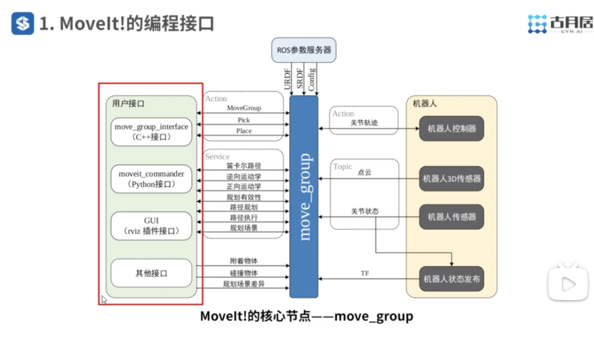
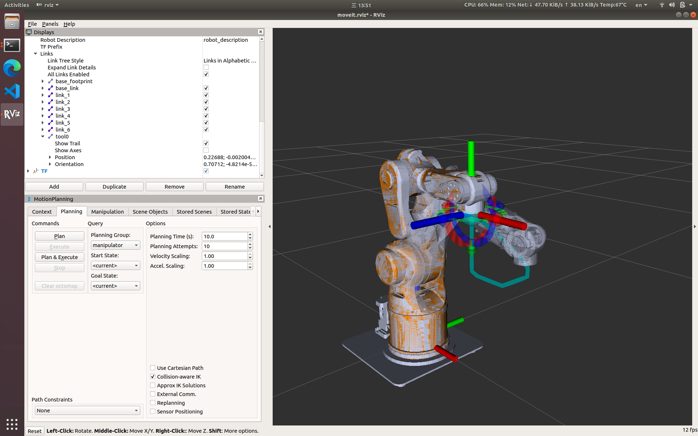
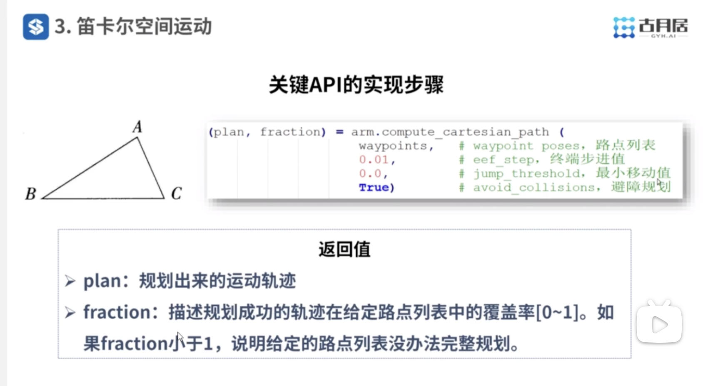
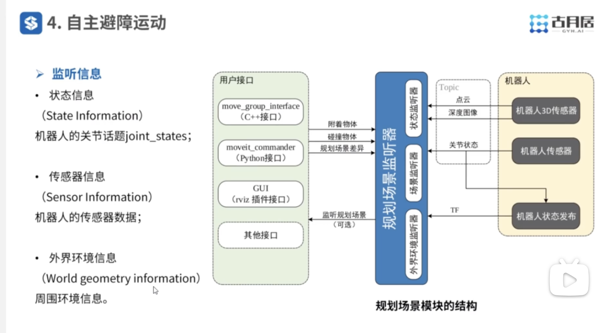
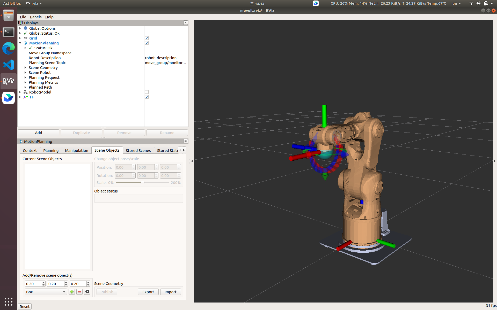

视频链接：
https://www.bilibili.com/video/BV1Mg4y127Z9?spm_id_from=333.788.player.switch&vd_source=c8dbe5ab3b4bf743fae13d455b4aa039&p=6

---

## Move Group 框架



moveit 的操作对象实际上是一个group，就是在 `MoveIt Setup Assistant` 中配置的规划组。

主要的编程流程：
1. 链接控制器需要的规划组；
2. 设置目标姿态（关节空间或者笛卡尔空间）；
3. 设置运动约束（可选）；
4. 执行轨迹规划；
5. 优化轨迹；
6. 执行规划出来的轨迹；

---
## 关节空间运动

 点到点运动：通过程序让机械臂从PoseA到PoseB，不需要在笛卡尔空间中规划轨迹，机械臂各个关节之间是不联动的；**每个关节在规划时是独立规划的，导致整个轨迹是任意的**，该方案是最常见的规划方案，只要能满足避障即可；

### 正向运动学规划

通过机器人各个关节的位置描述机器人的运动信息，如果是通过空间中的某一个点来计算机器人各个关节的位置就是逆向运动学。即怎么方便计算的就是正向运动学，不方便计算的就是逆向运动学；

```shell
$ roslaunch probot_anno_moveit_config demo.launch 
$ rosrun probot_demo moveit_fk_demo
```

demo 源码包文件： `probot_demo/scripts/moveit_fk_demo.py`

1. 确定运动组；
2. 确定目标位姿；
3. 执行规划并完成动作； 

```python 

import rospy, sys
import moveit_commander

class MoveItFkDemo:
    def __init__(self):
        # 初始化move_group的API
        moveit_commander.roscpp_initialize(sys.argv)

        # 初始化ROS节点
        rospy.init_node('moveit_fk_demo', anonymous=True)
 
        # 初始化需要使用move group控制的机械臂中的arm group
        arm = moveit_commander.MoveGroupCommander('manipulator')
        
        # 设置机械臂运动的允许误差值
        arm.set_goal_joint_tolerance(0.001)

        # 设置允许的最大速度和加速度
        arm.set_max_acceleration_scaling_factor(0.5)
        arm.set_max_velocity_scaling_factor(0.5)
        
        # 控制机械臂先回到初始化位置
        arm.set_named_target('home')
        arm.go()
        rospy.sleep(1)
         
        # 设置机械臂的目标位置，使用六轴的位置数据进行描述（单位：弧度）
        joint_positions = [0.391410, -0.676384, -0.376217, 0.0, 1.052834, 0.454125]
        arm.set_joint_value_target(joint_positions)
                 
        # 控制机械臂完成运动
        arm.go()
        rospy.sleep(1)

        # 控制机械臂先回到初始化位置
        arm.set_named_target('home')
        arm.go()
        rospy.sleep(1)
        
        # 关闭并退出moveit
        moveit_commander.roscpp_shutdown()
        moveit_commander.os._exit(0)

if __name__ == "__main__":
    try:
        MoveItFkDemo()
    except rospy.ROSInterruptException:
        pass

```


### 逆运动学规划

通常情况下很难确定机械臂到达某一点时各个关节的姿态，当需要让机械臂到达一个空间位置时需要反算各个关节的位姿，这就是逆运动学求解；

```shell
$ roslaunch probot_anno_moveit_config demo.launch 
$ rosrun probot_demo moveit_ik_demo 
```

这个demo中存在bug，运行后move_group节点会崩溃。

* 描述空间坐标系中某一个点时需要明确参考坐标系是什么，默认都是机械臂底座 `base_link`；
* 通常情况下运动学逆解求解时有些算法是存在失败概率的，所以应该允许算法执行失败的次数；

1. 确定规划组对象；
2. 获取机器人终端link名称；
3. 设置目标姿态对应的参考坐标系、起始与终止位姿；
4. 执行路径规划与运动； 

```python

import rospy, sys
import moveit_commander
from geometry_msgs.msg import PoseStamped, Pose


class MoveItIkDemo:
    def __init__(self):
        # 初始化move_group的API
        moveit_commander.roscpp_initialize(sys.argv)
        
        # 初始化ROS节点
        rospy.init_node('moveit_ik_demo')
                
        # 初始化需要使用move group控制的机械臂中的arm group
        arm = moveit_commander.MoveGroupCommander('manipulator')
                
        # 获取终端link的名称
        end_effector_link = arm.get_end_effector_link()
                        
        # 设置目标位置所使用的参考坐标系
        reference_frame = 'base_link'
        arm.set_pose_reference_frame(reference_frame)
                
        # 当运动规划失败后，允许重新规划
        arm.allow_replanning(True)
        
        # 设置位置(单位：米)和姿态（单位：弧度）的允许误差
        arm.set_goal_position_tolerance(0.001)
        arm.set_goal_orientation_tolerance(0.01)
       
        # 设置允许的最大速度和加速度
        arm.set_max_acceleration_scaling_factor(0.5)
        arm.set_max_velocity_scaling_factor(0.5)

        # 控制机械臂先回到初始化位置
        arm.set_named_target('home')
        arm.go()
        rospy.sleep(1)
               
        # 设置机械臂工作空间中的目标位姿，位置使用x、y、z坐标描述，
        # 姿态使用四元数描述，基于base_link坐标系
        target_pose = PoseStamped()
        target_pose.header.frame_id = reference_frame
        target_pose.header.stamp = rospy.Time.now()     
        target_pose.pose.position.x = 0.2593
        target_pose.pose.position.y = 0.0636
        target_pose.pose.position.z = 0.1787
        target_pose.pose.orientation.x = 0.70692
        target_pose.pose.orientation.y = 0.0
        target_pose.pose.orientation.z = 0.0
        target_pose.pose.orientation.w = 0.70729
        
        # 设置机器臂当前的状态作为运动初始状态
        arm.set_start_state_to_current_state()
        
        # 设置机械臂终端运动的目标位姿
        arm.set_pose_target(target_pose, end_effector_link)
        
        # 规划运动路径
        traj = arm.plan()
        
        # 按照规划的运动路径控制机械臂运动
        arm.execute(traj)
        rospy.sleep(1)

        # 控制机械臂回到初始化位置
        arm.set_named_target('home')
        arm.go()

        # 关闭并退出moveit
        moveit_commander.roscpp_shutdown()
        moveit_commander.os._exit(0)

if __name__ == "__main__":
    MoveItIkDemo()
```


---
## 笛卡尔空间运动

关节空间运动时在规划期间并不考虑机械臂轨迹形状，如果此时想要明确机械臂姿态为指定线条，特别是终端轨迹为明确线条（如写字绘画），那么就需要让机械臂在笛卡尔坐标系下运动；此时机器人的6个关节是有约束的，这几个关节之间必须联动；

```shell
$ roslaunch probot_anno_moveit_config demo.launch 
$ rosrun probot_demo moveit_cartesian_demo _cartesian=True (走直线)
$ rosrun probot_demo moveit_cartesian_demo _cartesian=Fals (自由运动)
```

在打开的rviz中可以选中机器人模型`RobotModel`，找到末端关节 `Links->tool0` 勾选显示轨迹 `Show Tail` 即可在rviz中将末端关节的轨迹显示出来



其实在笛卡尔空间中只要知道连续的路径点就可以让机械臂末端将这些点走出来，在笛卡尔坐标系规划中时将这些路径点一次性都给算法进行规划，而在关节坐标系规划时是逐个给点，这样就无法保证输出的路径是直线。


```python

import rospy, sys
import moveit_commander
from moveit_commander import MoveGroupCommander
from geometry_msgs.msg import Pose
from copy import deepcopy

class MoveItCartesianDemo:
    def __init__(self):
        # 初始化move_group的API
        moveit_commander.roscpp_initialize(sys.argv)

        # 初始化ROS节点
        rospy.init_node('moveit_cartesian_demo', anonymous=True)

        # 是否需要使用笛卡尔空间的运动规划
        cartesian = rospy.get_param('~cartesian', True)
                      
        # 初始化需要使用move group控制的机械臂中的arm group
        arm = MoveGroupCommander('manipulator')
        
        # 当运动规划失败后，允许重新规划
        arm.allow_replanning(True)
        
        # 设置目标位置所使用的参考坐标系
        arm.set_pose_reference_frame('base_link')
                
        # 设置位置(单位：米)和姿态（单位：弧度）的允许误差
        arm.set_goal_position_tolerance(0.001)
        arm.set_goal_orientation_tolerance(0.001)
        
        # 设置允许的最大速度和加速度
        arm.set_max_acceleration_scaling_factor(0.5)
        arm.set_max_velocity_scaling_factor(0.5)
        
        # 获取终端link的名称
        end_effector_link = arm.get_end_effector_link()

        # 控制机械臂先回到初始化位置
        arm.set_named_target('home')
        arm.go()
        rospy.sleep(1)
                                               
        # 获取当前位姿数据最为机械臂运动的起始位姿
        start_pose = arm.get_current_pose(end_effector_link).pose
                
        # 初始化路点列表
        waypoints = []

        # 将初始位姿加入路点列表
        if cartesian:
            waypoints.append(start_pose)
            
        # 设置路点数据，并加入路点列表
        wpose = deepcopy(start_pose)
        wpose.position.z -= 0.2

        if cartesian:
            waypoints.append(deepcopy(wpose))
        else:
            arm.set_pose_target(wpose)
            arm.go()
            rospy.sleep(1)

        wpose.position.x += 0.15

        if cartesian:
            waypoints.append(deepcopy(wpose))
        else:
            arm.set_pose_target( )
            arm.go()
            rospy.sleep(1)
        
        wpose.position.y += 0.1

        if cartesian:
            waypoints.append(deepcopy(wpose))
        else:
            arm.set_pose_target(wpose)
            arm.go()
            rospy.sleep(1)

        wpose.position.x -= 0.15
        wpose.position.y -= 0.1

        if cartesian:
            waypoints.append(deepcopy(wpose))
        else:
            arm.set_pose_target(wpose)
            arm.go()
            rospy.sleep(1)

        if cartesian:
		fraction = 0.0   #路径规划覆盖率
		maxtries = 100   #最大尝试规划次数
		attempts = 0     #已经尝试规划次数
		
		# 设置机器臂当前的状态作为运动初始状态
		arm.set_start_state_to_current_state()
	 
		# 尝试规划一条笛卡尔空间下的路径，依次通过所有路点
		while fraction < 1.0 and attempts < maxtries:
		    (plan, fraction) = arm.compute_cartesian_path (
		                            waypoints,   # waypoint poses，路点列表
		                            0.01,        # eef_step，终端步进值，计算直线时每隔0.01m进行一次关节点规划
		                            0.0,         # jump_threshold，跳跃阈值，如果在规划过程中中间某个点无法到达，那么允许跳跃的距离
		                            True)        # avoid_collisions，避障规划
		    
		    # 尝试次数累加
		    attempts += 1
		    
		    # 打印运动规划进程
		    if attempts % 10 == 0:
		        rospy.loginfo("Still trying after " + str(attempts) + " attempts...")
		             
		# 如果路径规划成功（覆盖率100%）,则开始控制机械臂运动
		if fraction == 1.0:
		    rospy.loginfo("Path computed successfully. Moving the arm.")
		    arm.execute(plan)
		    rospy.loginfo("Path execution complete.")
		# 如果路径规划失败，则打印失败信息
		else:
		    rospy.loginfo("Path planning failed with only " + str(fraction) + " success after " + str(maxtries) + " attempts.")  

		rospy.sleep(1)

        # 控制机械臂先回到初始化位置
        arm.set_named_target('home')
        arm.go()
        rospy.sleep(1)
        
        # 关闭并退出moveit
        moveit_commander.roscpp_shutdown()
        moveit_commander.os._exit(0)

if __name__ == "__main__":
    try:
        MoveItCartesianDemo()
    except rospy.ROSInterruptException:
        pass
```

在上面的代码中有两个比较重要的参数：
1. `eef_step`：路径规划步长，即相邻两个点之间的间距；
2. `jump_threshold`：跳跃阈值，当相邻两个点无法规划出一条轨迹时，如果这两个点之间的距离小于该与值则直接跳过并规划下一个点，超过该阈值且规划失败则报错；
3. `fraction`：规划出来的轨迹可以完成的百分比，如规划出来一条1m的轨迹，其中可以走0.7m则为 70%；



【注】：在ROS中并没有提供曲线的执行方式，但可以通过微分的形式将曲线转换成圆弧；

---

## 规划避障



核心在于如何将障碍物信息加载进来，通过 **规划场景监听器** 判断机器人所处环境中是否存在障碍物； ROS提供了三种加载方式：

* Rviz-GUI 界面加载；
* Code编程加载；
* Sensor传感器检测；

### Rviz-GUI界面加载

在运行demo后启动的 Rviz 界面左下角中的 `Motion Planning` 窗口中有一个 `Sence Objects` 用来加载障碍物，点击 `Import` 按钮就可以将 gazebo 中的模型、Solidworks生成的模型加载进来；

```
$ roslaunch probot_anno_moveit_config demo.launch
```



在加载好对象后还需要点击 `Publish` 将对象所在的位置发布出去；


### Code编程加载

使用代码将障碍物物体加载进入机器人空间中

```shell
$ roslaunch probot_anno_moveit_config demo.launch
$ rosrun probot_demo moveit_attached_object_demo.py
```

【注】：此处可能存在无法找到或者正确运行 .py 文件的问题，需要执行以下动作才可以：
```shell
$ chmod +x src/probot_demo/scripts/moveit_attached_object_demo.py 
$ conda deactivate
```

```python

import rospy, sys
import thread, copy
import moveit_commander
from moveit_commander import RobotCommander, MoveGroupCommander, PlanningSceneInterface
from geometry_msgs.msg import PoseStamped, Pose
from moveit_msgs.msg import CollisionObject, AttachedCollisionObject, PlanningScene
from math import radians
from copy import deepcopy

class MoveAttachedObjectDemo:
    def __init__(self):
        # 初始化move_group的API
        moveit_commander.roscpp_initialize(sys.argv)
        
        # 初始化ROS节点
        rospy.init_node('moveit_attached_object_demo')
        
        # 初始化场景对象
        scene = PlanningSceneInterface()
        rospy.sleep(1)
                                
        # 初始化需要使用move group控制的机械臂中的arm group
        arm = MoveGroupCommander('manipulator')
        
        # 获取终端link的名称
        end_effector_link = arm.get_end_effector_link()
        
        # 设置位置(单位：米)和姿态（单位：弧度）的允许误差
        arm.set_goal_position_tolerance(0.01)
        arm.set_goal_orientation_tolerance(0.05)
       
        # 当运动规划失败后，允许重新规划
        arm.allow_replanning(True)
        arm.set_planning_time(10)

        # 控制机械臂回到初始化位置
        arm.set_named_target('home')
        arm.go()
        
        # 移除场景中之前运行残留的物体
        scene.remove_attached_object(end_effector_link, 'tool')
        scene.remove_world_object('table') 
        scene.remove_world_object('target')

        # 设置桌面的高度
        table_ground = 0.6
        
        # 设置table和tool的三维尺寸
        table_size = [0.1, 0.7, 0.01]
        tool_size = [0.2, 0.02, 0.02]
        
        # 设置tool的位姿
        p = PoseStamped()
        p.header.frame_id = end_effector_link
        
        p.pose.position.x = tool_size[0] / 2.0 - 0.025
        p.pose.position.y = -0.015
        p.pose.position.z = 0.0
        p.pose.orientation.x = 0
        p.pose.orientation.y = 0
        p.pose.orientation.z = 0
        p.pose.orientation.w = 1
        
        # 将tool附着到机器人的终端
        scene.attach_box(end_effector_link, 'tool', p, tool_size)

        # 将table加入场景当中
        table_pose = PoseStamped()
        table_pose.header.frame_id = 'base_link'
        table_pose.pose.position.x = 0.25
        table_pose.pose.position.y = 0.0
        table_pose.pose.position.z = table_ground + table_size[2] / 2.0
        table_pose.pose.orientation.w = 1.0
        scene.add_box('table', table_pose, table_size)
        
        rospy.sleep(2)  

        # 更新当前的位姿
        arm.set_start_state_to_current_state()

        # 设置机械臂的目标位置，使用六轴的位置数据进行描述（单位：弧度）
        joint_positions = [0.827228546495185, 0.29496592875743577, 1.1185644936946095, -0.7987583317769674, -0.18950024740190782, 0.11752152218233858]
        arm.set_joint_value_target(joint_positions)
                 
        # 控制机械臂完成运动
        arm.go()
        rospy.sleep(1)
        
        # 控制机械臂回到初始化位置
        arm.set_named_target('home')
        arm.go()

        moveit_commander.roscpp_shutdown()
        moveit_commander.os._exit(0)

if __name__ == "__main__":
    MoveAttachedObjectDemo()
```

上面代码中的两个关键部分：
* `attach_box`：将障碍物附着在机器人身上；
* `add_box`：将障碍物添加到机器人工作环境上；
