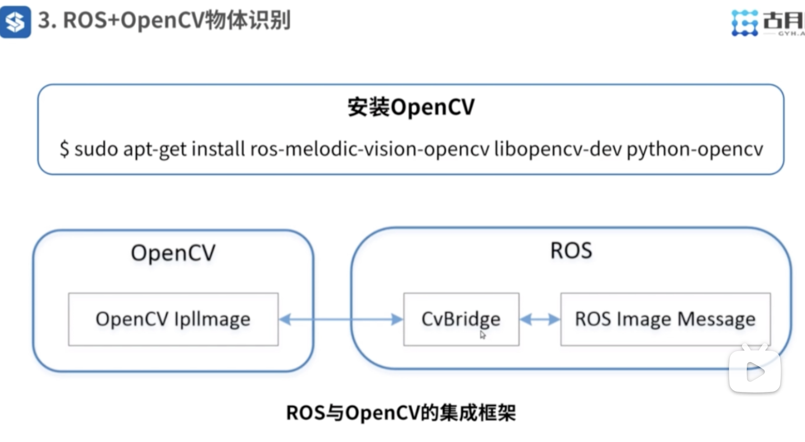

视频链接：
https://www.bilibili.com/video/BV1Mg4y127Z9?spm_id_from=333.788.player.switch&vd_source=c8dbe5ab3b4bf743fae13d455b4aa039&p=8

---

1. ROS 图像接口；
2. 摄像头内参标定；
3. ROS+OpenCV物体识别；

---
## ROS 图像接口

```shell
$ sudo apt-get install ros-melodic-usb-cam
$ roslaunch probot_vision usb_cam.launch 
```

启动之后就能看见笔记本的摄像头指示灯变亮；
```shell
$ rosrun rqt_image_view rqt_image_view
```

原始数据：
```shell
$ 
header: 
  seq: 62
  stamp: 
    secs: 1735116426
    nsecs: 314525193
  frame_id: "usb_cam"
height: 480
width: 640
encoding: "rgb8"
is_bigendian: 0
step: 1920
data: [...] # size=height*width*8byte
```

压缩后的数据：
```shell
$ rostopic echo /usb_cam/image_raw/compressed
header: 
  seq: 324
  stamp: 
    secs: 1735116541
    nsecs: 691290534
  frame_id: "usb_cam"
format: "rgb8; jpeg compressed bgr8"
```

---
## 摄像头内参标定

```shell
$ sudo apt-get install ros-melodic-camera-calibration
```

 内参：摄像头内部光学传感器畸变；
 外参：摄像头与机器人本体之间的位置关系；

```shell
$ rosrun camera_calibration cameracalibrator.py --size 8x6 --square 0.024 image:=/usb_cam/image_raw camera:=/usb_cam
```

然后在相机驱动启动文件中指明内参文件：
```xml
<launch>

    <node name="usb_cam" pkg="usb_cam" type="usb_cam_node" output="screen" >
        <param name="video_device" value="/dev/video0" />
        <param name="image_width" value="1280" />
        <param name="image_height" value="720" />
        <param name="pixel_format" value="yuyv" />
        <param name="camera_frame_id" value="usb_cam" />
        <param name="io_method" value="mmap"/>
		<!-- 内参标定结果 -->
        <param name="camera_info_url" type="string" value="file://$(find probot_vision)/camera_calibration.yaml" />
    </node>

</launch>
```


---
## ROS + OpenCV 物体识别

```shell
$ sudo apt-get install ros-melodic-vision-opencv libopencv-dev python-opencv
```



```shell
$ rosrun probot_vision image_converter 
$ rosrun rqt_image rqt_image
```

在仿真环境中使用摄像头识别物体
```shell
$ roslaunch probot_gazebo probot_anno_with_gripper_gazebo_world.launch 
$ rosrun probot_vision visonManager
```

这里的demo识别原理是使用物体与周围颜色分割得到的。

---

