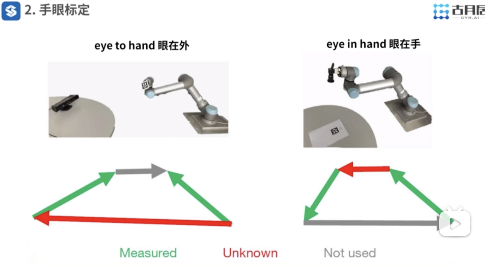
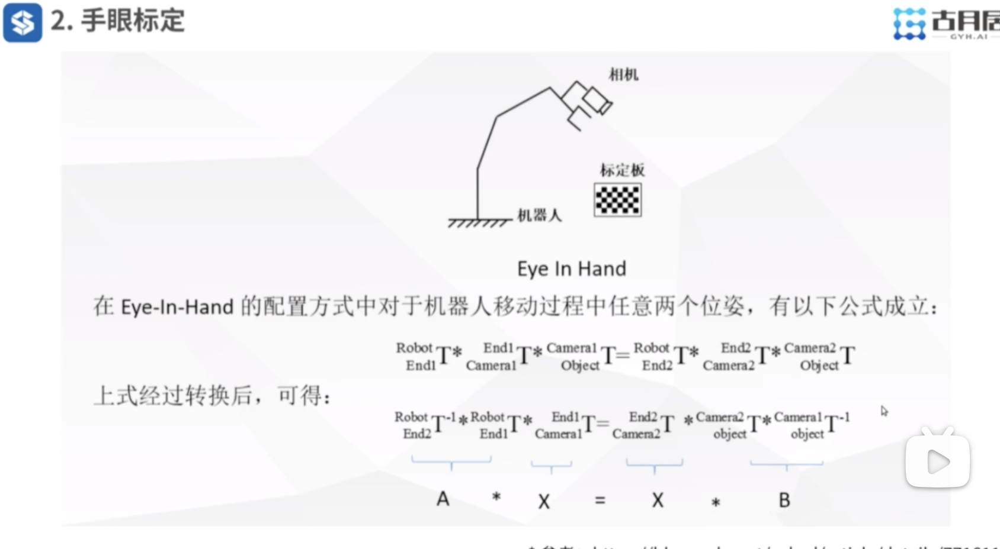
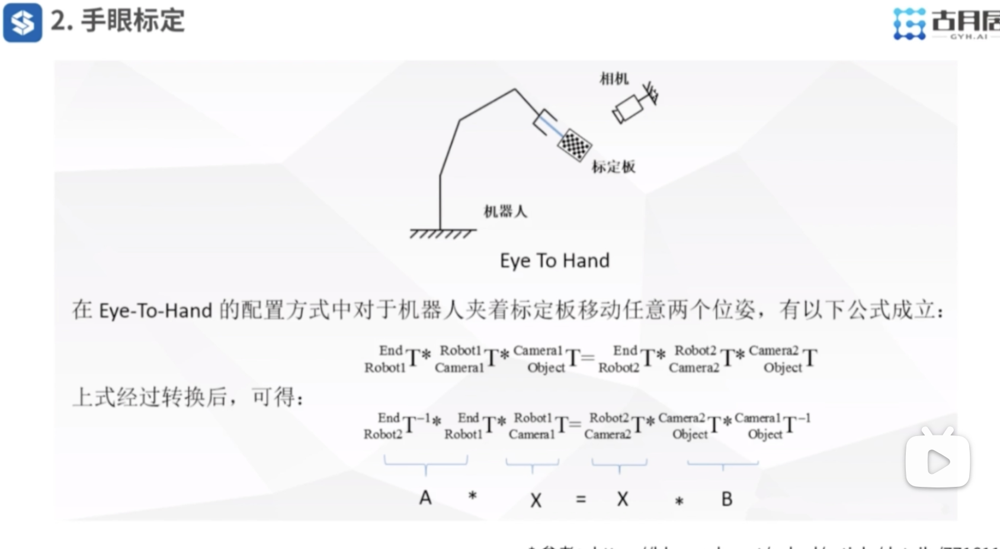

视频链接：
https://www.bilibili.com/video/BV1Mg4y127Z9?spm_id_from=333.788.videopod.episodes&vd_source=c8dbe5ab3b4bf743fae13d455b4aa039&p=9

---
## 视觉抓取的关键技术

1. 手眼标定（内参、外参）；
	* `camera_calibration`
	* `visp_hand2eye_calibration`
	* `ros easy_handeye`
2. 物体识别与定位；
	* `find_object_2d`
	* `Tensorflow Object Detection API`
	* `Object Recongition`
3. 机械臂末端抓取姿态分析；
	* `aglie_grasp`
	* `graspit`
	* `moveit_simpel_grasps`
4. 运动规划；
	* 轨迹规划
	* 运动学
	* 动力学
	* 避障


---
## 手眼标定



外参标定的核心关键是求解上图中两种情况的 **红色向量**；





---
## 视觉抓取

仿真demo：
```shell
$ roslaunch probot_grasping probot_anno_grasping_demo.launch
```

整个机械臂抓取流程：
1. 让机械臂到达一个初始位置，为了给相机让出视野；
2. 让相机对目标物体进行识别并将其转换到3D空间坐标；
3. 让机械臂执行路径规划与动作；

【注】在整个视觉抓取过程中，内外参标定是十分重要的，这会直接影响到抓取的精度与结果；

---
