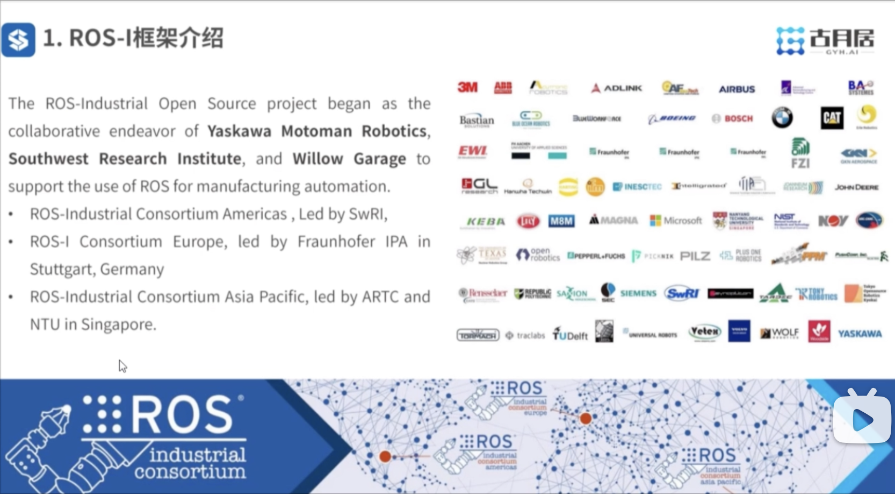
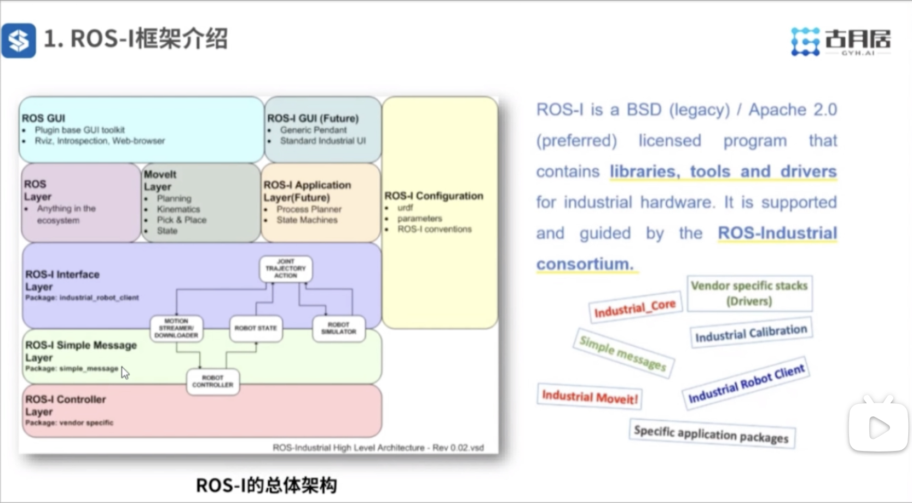
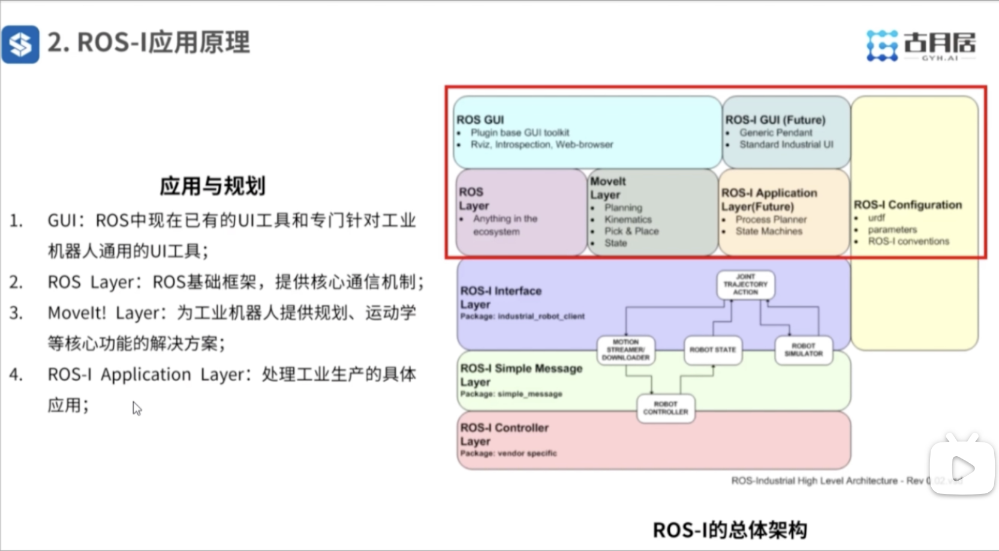
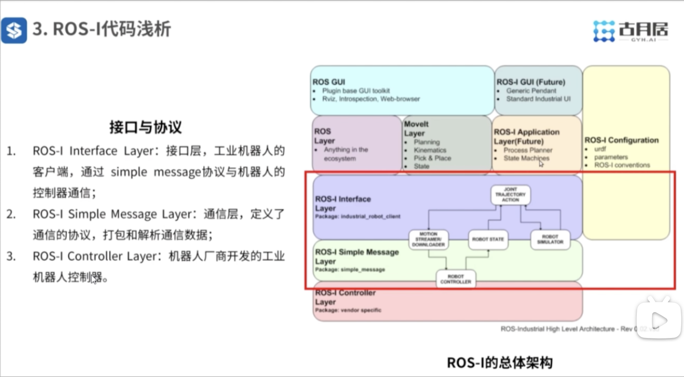

视频链接：
https://www.bilibili.com/video/BV1Mg4y127Z9?spm_id_from=333.788.player.switch&vd_source=c8dbe5ab3b4bf743fae13d455b4aa039&p=10

---
## ROS + Industry 

目的是将ROS推入到工业领域中，由三个主要研究机构推广ROS-I



ROS-I 目标：
1. 将ROS的强大功能应用到工业领域中；
2. 为工业机器人的研究与应用提供快捷有效的开发途径；
3. 为工业机器人创造一个强大的开源社区；
4. 为工业机器人提供一站式工业ROS应用解决方案； 



---
## ROS-I 应用



强烈推荐在 Github 上去查找开源应用源码：
```shell
$ https://github.com/ros-industrial-consortium
$ https://github.com/ros-industrial-attic/godel
```

---
## ROS-I 代码分析



 